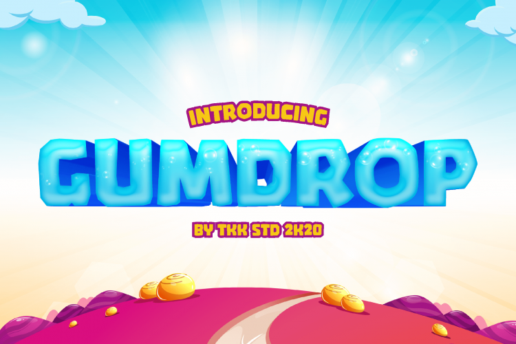

Elegir la fuente o tipografía adecuada en un videojuego es super importante para definir su estética y mejorar la experiencia del jugador.

En este artículo, encontrarás 20 fuentes épicas, desde estilos retro pixelados hasta diseños futuristas, que harán que tu juego o tu aplicación luzca increíble.

## 1. Arcadia

Tipografía moderna de ciencia ficción con diseño deportivo para logos de esports.

https://www.creativefabrica.com/es/product/arcadia/

## 2. CageWorld

Fuente vintage artesanal ideal para logotipos, etiquetas, camisetas, empaques, invitaciones y diseños clásicos.  
https://ifonts.xyz/cageworld-font.html

## 3. Caveman

Diseñada para parecer tallada en piedra, perfecta para juegos de supervivencia y aventuras prehistóricas.  
https://elements.envato.com/caveman-gaming-font-W3R2EAM

## 4. Dankosaurus

Tipografía inspirada en dinosaurios para juegos infantiles, disponible en estilos _regular_ y _redondeado_.  
https://www.1001fonts.com/dankosaurus-font.html

## 5. Fun Blob

Tipografía divertida y juguetona, ideal para juegos infantiles y diseños creativos.  
https://www.dafont.com/fun-blob.font

## 6. Game Over Brush SVG Font

Fuente tipo pincel, ideal para juegos de terror y proyectos artísticos.  
https://www.youworkforthem.com/font/T19474/game-over-brush-svg

## 7. Gore

Tipografía para juegos oscuros y de terror, con letras gruesas sin curvas.  
https://www.tugcu.co/fonts/p/gore

## 8. Grind Demolished

Grind es un tipo de letra grande y atrevida que transmite fuerza y dureza.  
https://elements.envato.com/grind-demolished-Q6W5BGA

## 9. GUMDROP

Tipografía divertida y juguetona, ideal para juegos infantiles y diseños creativos.  
https://justtheskills.com/product/gaming-font-gumdrop/

## 10. Hermes

Tipografía moderna. Estilo Cyberpunk que combina estilo retro y futurista.  
https://befonts.com/hermes-typeface.html

## 11. Monstarize

Tipografía de terror con letras que parecen gotear.  
https://www.dafont.com/monstarize.font

## 12. Nordic Light

Fuente moderna con mezcla de esquinas cuadradas, ideal para títulos o posters.  
https://fontesk.com/nordic-light-font/

## 13. Pixel Rand

Píxeles en posiciones aleatorias: estilo moderno perfecto para videojuegos pixelados, videos y proyectos retro.  
https://elements.envato.com/pixel-rand-B3AFEYM

## 14. River Adventurer

Fuente sans-serif en mayúsculas que evoca aventuras en la jungla.  
https://www.1001fonts.com/river-adventurer-font.html

## 15. Rockgan Space Game

Fuente espacial con diseño juguetón para juegos móviles temáticos.  
https://elements.envato.com/rockgan-space-game-display-font-HQ558Y6

## 16. Royal Kingdom

Fuente estilizada tipo cartoon, perfecta para interfaces de juegos y productos de merchandising.  
https://fontbundles.net/sensatype/2533167-royal-kingdom-cartoon-game-font

## 17. Scrubland

Tipografía moderna con un toque de naturaleza, ideal para juegos de aventura y exploración.  
https://fontesk.com/scrubland-font/

## 18. Victorius

Diseño inspirado en textos griegos antiguos, ideal para juegos de gladiadores.  
https://fontesk.com/victorious-font/

## 19. Tsuki

Tsuki es una fuente sans-serif inspirada en el concepto y tema de los mangas y videojuegos japoneses.  
https://www.creativefabrica.com/product/tsuki/

## 20. Guava Candy

Guava Candy es una fuente en mayúsculas que inspira una sensación de diversión y felicidad.  
https://www.1001fonts.com/guava-candy-font.html

--- 

Elegir la fuente adecuada puede marcar la diferencia en la experiencia del jugador. Las fuentes mencionadas son solo algunas de las muchas opciones disponibles, pero cada una tiene su propio estilo y personalidad.

Recuerda que la tipografía es una parte fundamental del diseño de videojuegos y puede influir en la percepción del jugador sobre el juego. Así que elige sabiamente y diviértete creando tu próximo proyecto.

¿Cuál es tu fuente favorita? ¿Cuál de estas te gusta más? Si tienes alguna tipografía gaming favorita que falta en esta lista, ¡deja un comentario! Me encantaría saber qué piensas y qué fuentes utilizas en tus proyectos de videojuegos.