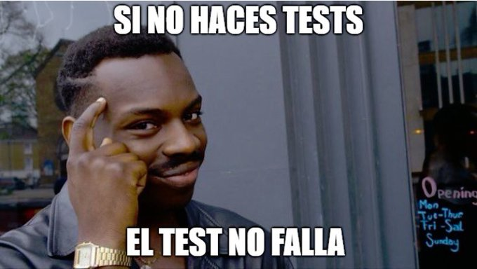

¿Tienes tests en tus desarrollos de software?

Hola querido/a dev. En este escrito vamos a intentar redactar de manera amigable algunos aspectos del **testing** de aplicaciones.

Como developer, cuando entregas un proyecto, quieres que el código entregado sea lo más robusto posible y sin errores.

¿Qué pasa si haces una subida a producción el viernes a última hora? Llega el lunes y te das cuenta de que los cambios que hiciste el viernes provocaron que la aplicación se rompiera. Has estado 3 días con tu aplicación rota y no te has dado cuenta 💀.

Entonces, developer, ¿cómo puedes ayudar a evitar este tipo de situaciones? Exacto, testeando tu código.

Sin embargo, no todo es tan sencillo como parece. Hay que tener en cuenta que:

- Un buen sistema de testing puede acelerar el desarrollo, mejorar la calidad del código y reducir los errores de tu aplicación.
- Un mal enfoque de testing puede ser perjudicial para tu aplicación.

## ¿Qué es probar (testear) una aplicación?

Desde mi punto de vista, se podría decir que testear es _“el proceso de comprobar que tu aplicación funciona correctamente”_.

Nuestras aplicaciones se pueden probar de 2 formas: de forma **manual** o de forma **automática**.

## Pruebas Manuales

Como su propio nombre indica, consiste en hacer las comprobaciones a mano. Es lo que haces cada vez que terminas una tarea.

Esto te lleva un par de segundos o minutos, dependiendo de lo que tengas que probar: levantar servidores, servicios, introducir datos, etc.
Si al hacer las pruebas estuviéramos hablando de minutos en vez de segundos, estaríamos ante un proceso costoso, ¡no solo en tiempo! También mentalmente.

Hacer las pruebas a mano puede ser una opción válida en aplicaciones pequeñas o POCs, donde el tiempo que se invierte en probar la aplicación es mínimo.

Ahora es cuando tienes que definir qué es o qué se considera un proyecto pequeño o grande. Este ejercicio te lo dejo a ti.

## ¿Qué pasa cuando estás en un proyecto grande?

Un proyecto donde sea complicado seguir el flujo de la lógica de la aplicación. Con muchas funcionalidades. Un proyecto pequeño que se ha convertido, progresivamente, en uno grande y complejo.

Tu proyecto ha crecido tanto que necesitas un equipo que se dedique exclusivamente a probar que todo funciona como es debido cada vez que se añade una nueva funcionalidad.

**Toda pieza de software tiene bugs**, esto es un hecho. Bugs que no quieres que lleguen al usuario o al cliente final, bugs que quieres detectar antes de que se desplieguen en pro con la nueva funcionalidad.

Incluso con un equipo que se dedique exclusivamente a testear, no tienes la garantía de que se vayan a detectar todos los posibles errores que pueda tener tu aplicación.

¿Sabes por qué? Porque las pruebas manuales requieren mucha concentración y es fácil despistarse. Lo que es probable que tu código no esté funcionando como es debido y tu equipo de testing no se haya dado cuenta.

Llegados a este momento, seguramente pases más tiempo probando las funcionalidades antiguas que probando las nuevas. Todo debido a que no tienes un mecanismo que te garantice que la aplicación funciona correctamente con cada cambio que haces.

Espero que ahora entiendas la **necesidad** de tener pruebas automáticas. 🙌

## Pruebas Automáticas

Entendamos por pruebas automáticas el proceso de escribir código que realice dichas comprobaciones por ti. Aunque suene raro.

> De ahora en adelante, cuando hablemos de pruebas, nos estaremos refiriendo a pruebas automáticas.

¡Sí! Vas a escribir código extra que compruebe el código de tu aplicación. A cambio, ganas que cuando dicho código esté listo, puedas probar tu aplicación las veces que quieras sin apenas esfuerzo y en cuestión de segundos.

Hay varias técnicas para automatizar los tests, cada una con sus pros y sus contras. Todas tienen algo en común: _los tests te van a ahorrar tiempo a la hora de probar tu aplicación_.

Todo el tiempo que se invertía en probar la aplicación anterior, se podría reducir considerablemente con esta práctica.

Hace unos años compartí en Twitter / 𝕏 [este meme](https://twitter.com/baumannzone/status/648826797770043392). Describe a la perfección esa sensación que te invade el cuerpo cuando todos los tests de tu aplicación están en verde.

## Happy developers!

A todo lo anterior le podemos añadir que tener tests en nuestra aplicación es sinónimo de tener un **equipo de desarrollo** feliz y motivado, que trabaja con seguridad y confianza en el proyecto.

Equipo que está convencido de que puede desarrollar nuevas funcionalidades sin miedo a romper otras partes de la aplicación, ya que confía en que los tests van a detectar cualquier fallo que se haya podido introducir. Y si eso ocurre, caso que es muy probable, dicho fallo se va a detectar a tiempo y se va a poder resolver de manera sencilla.

## Cuando no testear

También existe la posibilidad de que tener pruebas automáticas haga más lenta tu experiencia de desarrollo. Es decir, que los tests te perjudiquen más que te beneficien. Recordemos que uno de los propósitos de las pruebas automáticas es **ahorrar tiempo**.

A modo resumen, quédate con esto:

- No siempre hace falta tener pruebas automáticas (_OMG, ¿en qué quedamos?_)
- No necesitas tests si pasas más tiempo re-escribiendo tests que desarrollando funcionalidades (Ej: prototipos, proyectos inestables y cortos)
- Tu objetivo no es llegar al 100% de code coverage en tus tests.

Si el testing te da muchos problemas, siempre puedes poner en práctica [esto](https://x.com/baumannzone/status/1796104287543611658).

---

Existe un gigantesco mundo alrededor del testing: librerías, frameworks, test runners, herramientas, plugins... En futuras publicaciones seguiremos hablando de testing.

Espero que leer esto te haya motivado a hacer tests, que te hayas convencido de que los tests son el bien y que el testing es un mundo fantástico 🧙.

Dime qué te pareció por [Instagram](https://instagram.com/baumannzone) y compártelo si te ha sido útil. Recuerda, _sharing is caring_.

¡Happy testing! 👋
