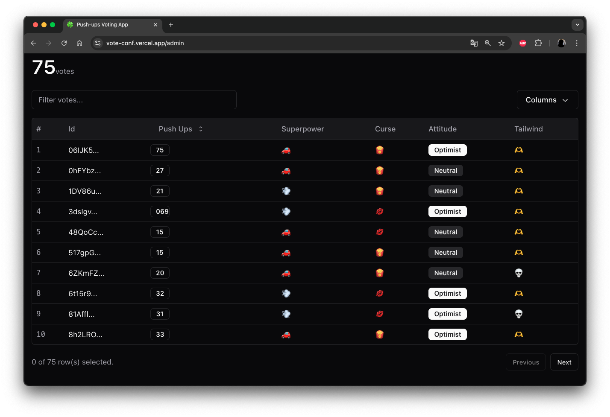

Mucha gente pierde oportunidades profesionales sin darse cuenta. El motivo casi siempre es el mismo: el miedo a hablar en público. Paradójicamente, justo esa habilidad que evitamos es la que puede marcar un antes y un después en nuestra carrera.

> Dar una charla técnica no tiene por qué ser aburrido: a veces hay caballos y trajes de Super Mario 🍄🎤

La evidencia científica lo demuestra una y otra vez: cuando alguien del mundillo tech trabaja su comunicación, no solo gana confianza, también mejora la forma en la que explica lo técnico y lo no técnico. Y en nuestra industria eso está muy valorado.

Hablar en público no es un detalle menor, es realmente una palanca de crecimiento. Este artículo revelará el poder transformador de hablar en público y cómo puedes dominarlo, cómo prepararte y qué beneficios trae a tu desarrollo profesional y personal.

## El poder transformador de hablar en público para software developers

¿Crees que hablar en público es solo cosa de managers o de marketing? **ERROR**. Como software engineer, mejorar tu oratoria o dar charlas puede darle un giro brutal a tu carrera.

No hablo solo de **oportunidades laborales** (que también, y esto lo digo por experiencia propia), sino de crecimiento personal. Te cambia la forma en la que te relacionas con otros humanos: de repente quieren charlar contigo, colaborar en proyectos o directamente trabajar a tu lado.

Es como desbloquear un superpoder que casi nadie se molesta en entrenar. Y justo por eso marca tanta diferencia.

### Crecimiento profesional: más allá del código

Saber programar es la base, pero lo que te diferencia es cómo comunicas tus ideas. Un developer que se expresa bien destaca.

- **Amplía tu red**. Hablar en público te conecta con posibles colaboradores, mentores y empleadores.
- **Posiciona tu experiencia**. Dar charlas muestra lo que sabes y te convierte en referente en tu área.
- **Mejora el trabajo en equipo**. Explicar ideas complejas con claridad reduce malentendidos y facilita el liderazgo.

Hablar en público no es solo una _soft skill_: es una ventaja competitiva que el código, por sí solo, no te va a dar.

### Desarrollo personal: confianza++

Mejorar tu comunicación también te hace crecer como persona.

- **Más confianza**. Con cada charla bajan los nervios y sube tu seguridad.
- **Comunicación más clara**. Aprendes a traducir lo técnico en ideas accesibles para cualquier contexto.
- **Aprendizaje constante**. Preparar charlas te obliga a investigar, ordenar ideas y mantenerte al día.

> **Pro tip**: no empieces en un auditorio gigante. Arranca en petit comité: presenta algo en tu equipo, lidera una daily o súmate a un meetup pequeño. La confianza se construye charla a charla.

En resumen: hablar en público no va solo de compartir conocimiento; te ayuda a crecer, aportar a la comunidad y abrir oportunidades reales.

## Cómo prepararse eficazmente para una charla técnica

Vale, ya vimos por qué dar charlas merece la pena. Ahora viene lo importante: cómo preparar una charla técnica que se entienda, enganche y no se haga pesada.

### Conoce a tu público

Antes de abrir las diapositivas, define para quién hablas. Si tu audiencia es técnica, puedes profundizar sin miedo.

Si vas a hablar con managers o perfiles menos técnicos, simplifica el lenguaje y usa ejemplos más cercanos al negocio. La clave es que te entiendan.

### Define objetivos claros

Antes de preparar slides, responde esto: **¿qué quiero que la gente se lleve de esta charla?**

Puede ser aprender una tecnología, evitar un error común o entender cómo resolviste un problema real. Si defines ese objetivo desde el inicio, todo lo demás se ordena solo.

### Estructura tu presentación

Piensa tu charla como una historia en tres actos:

1. **Introducción**: Presenta el tema y lo que la audiencia puede esperar.
2. **Cuerpo**: Divide el contenido en secciones lógicas. Usa ejemplos y casos prácticos para ilustrar puntos clave. No te olvides de los memes.
3. **Conclusión**: Resume los puntos principales y ofrece un llamado a la acción o preguntas para reflexionar.

### Desarrolla visuales atractivos

Las slides están para reforzar tu mensaje, no para reemplazarte. Si las haces bien, la gente te sigue mejor y recuerda más.

* **Poco texto**: Frases cortas, ideas claras. Nada de párrafos.
* **Consistencia visual**: Mantén tipografía, colores y estilo en toda la presentación.
* **Contraste y legibilidad**: Si no se lee al fondo de la sala, no sirve.
* **Visuales con intención**: Usa imágenes o gráficos que expliquen algo, no solo que decoren.
* **Humor con criterio**: Un meme bien puesto despierta a la audiencia.
* **Una idea por slide**: Mejor varias slides limpias que una diapositiva saturada.

### Incorpora narrativa

Una charla técnica sin narrativa se siente como documentación leída en voz alta. Si armas un hilo, la gente conecta y entiende mejor.

Por ejemplo, en mi charla "**JavaScript 🤝 TikTok**" arranco con el gancho de "salvar TikTok del ban en EEUU" y desde ahí aterrizo cómo funciona JavaScript en el navegador. Primero captas atención, luego profundizas en lo técnico.

### Practicando tu presentación: desde casa hasta el escenario

> TL;DR: practica, practica, practica, practica, practica y practica.
#### Ensaya absolutamente todo

La diferencia entre una charla floja y una charla sólida suele estar en el ensayo. Practica varias veces como si ya estuvieras en el escenario y fíjate en:

- **Tiempo**: Asegura que no te pasas del tiempo asignado.
- **Claridad**: Articula bien y modula la voz para mantener la atención.
- **Pausas**: Usa pausas para enfatizar puntos clave y dar tiempo a la audiencia para procesar la información.
- **Lenguaje Corporal**: Usa gestos y movimiento para enfatizar puntos. Nada de manos en los bolsillos.
- **Feedback**: Practica frente a amigos o compañeros para recibir feedback real.

Repite la charla completa hasta que te salga natural. Sí, al principio se siente raro hablarle al espejo, al perro o grabarte. Hazlo igual. No existe el "_he practicado demasiado_" cuando quieres dar una buena charla. Ese concepto no existe.

### Prepárate para aspectos técnicos

Antes de subir al escenario, haz un checklist técnico:

* **Diapositivas**: Lleva versión offline por si te quedas sin WiFi.
* **Conexiones**: Lleva cables, adaptadores y lo que necesites para tu portátil.
* **Audio/Visual**: Revisa con el equipo técnico micro, pantalla y sonido.
* **Plan B**: Si la demo falla, tira de video pregrabado o capturas.

### Interactúa con la Audiencia

Mantén contacto visual y sé receptivo a las señales de la audiencia. Fomentar preguntas o discusiones puede crear una sesión más interactiva y atractiva.

En mi caso, suelo preparar una app de votos o encuestas rápidas para que la gente participe en vivo. Con las herramientas de vibe-coding, hoy montarlo es mucho más fácil.

Si quieres saber más sobre oratoria, revisa el siguiente video de _Vinh Giang_ (me encanta este notas):

## Networking

Dar una charla no termina cuando bajas del escenario.

Ahí empieza el networking de verdad: gente que conecta contigo por lo que acabas de compartir.

No tienes que forzar conversaciones ni perseguir a nadie. Compartes algo útil, alguien piensa "_esta persona sabe de esto_" y se acerca en el descanso. Conexión natural.

## Conclusión

Dar charlas como developer no va solo de hablar bien. Va de aprender mejor, comunicar con claridad y generar impacto con lo que sabes. 

Además, compartir conocimientos en eventos tech contribuye a la construcción de comunidades y expande las redes de contacto, abriendo puertas a nuevas oportunidades de colaboración y crecimiento profesional.

Si estás empezando, no busques perfección: elige un tema que te guste, prepara una versión corta y pruébala en un entorno pequeño. A partir de ahí, itera con feedback y vuelve a subirte al escenario.
