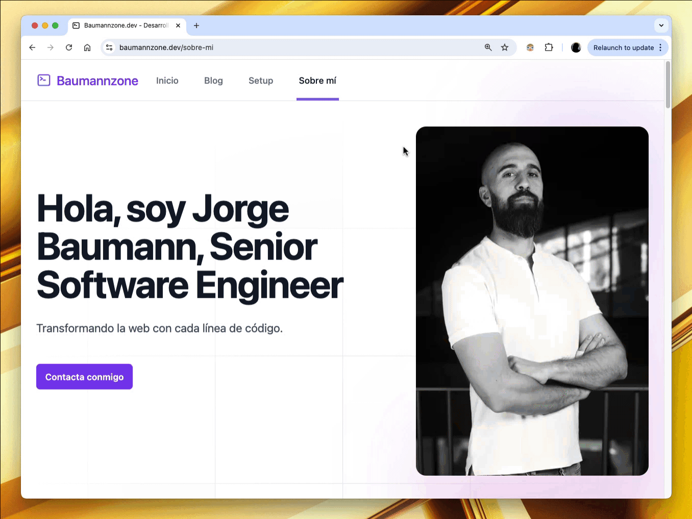

Saber qué elemento HTML tiene el foco (`focus`) en tu navegador puede ser un poco complicado, ya que si quieres usar JavaScript para detectarlo, tendrías que estar constantemente revisando si el foco cambió con un evento de escucha.

Afortunadamente, la consola de tu navegador tiene una funcionalidad llamada "live expressions" que te permite ejecutar expresiones en tiempo real.

Para detectar el elemento con el foco en tiempo real, sigue estos pasos:

- Abre las Developer Tools de tu navegador, en la pestaña de consola. Puedes abrir las DevTools presionando `F12` o `Cmd` + `Option` + `I` (en macOS).
- En la parte superior verás un botón con un icono en forma de ojo. Haz clic en él para crear una expresión en vivo.
- En el cuadro de texto que aparece, escribe `document.activeElement`. Este código hace referencia al elemento del DOM que tiene el foco en ese momento.
- Ahora navega por la página haciendo clic o usando la tecla de tabulación (`Tab`) para cambiar el foco entre los elementos interactivos. La expresión en vivo se actualizará automáticamente para reflejar cuál es el elemento que tiene el foco en ese momento.

Con esta sencilla técnica, puedes ver de forma dinámica qué elemento tiene el foco en cualquier momento mientras interactúas con tu página web.

¿Qué otros casos de uso conoces para las "_live expressions_" de la consola de tu navegador? ¡Déjame un comentario abajo!
