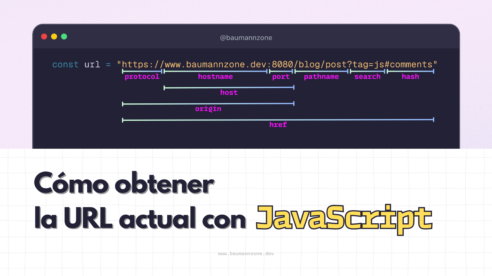

Cuando estás construyendo una app frontend, ya sea con React, Vue, o vanilla JS, es bastante común necesitar acceder a la URL actual. Quizás para:

- **Leer parámetros** (`?id=123`)
- **Validar rutas** (`/user` vs `/admin`)
- **Detectar entornos** (_local_ vs _producción_)
- **Navegar programáticamente** (sin `<a href>`)

## TL;DR

```js
const url = window.location.href;
console.log(url);

// https://www.baumannzone.dev/blog/como-obtener-la-url-actual-con-javascript-y-sacarle-provecho
```

## Desglose: todas las partes de la URL

Supongamos que estás en esta URL:

```
https://www.baumannzone.dev:8080/blog/post?tag=js#comments
```

Puedes extraer sus partes así:

```js
const {
  host,       // "www.baumannzone.dev:8080"
  hostname,   // "www.baumannzone.dev"
  href,       // (URL completa)
  origin,     // "https://www.baumannzone.dev:8080"
  pathname,   // "/blog/post"
  port,       // "8080"
  protocol,   // "https:"
  search      // "?tag=js"
  hash,       // "#comments"
} = window.location;
```

⚠️ **Ojo**: `host` incluye el puerto, `hostname` no. ¡Detalles como este pueden causar bugs!



## Ejemplos útiles y reales

Dada esta URL, `https://www.baumannzone.dev:8080/blog/post?tag=js#comments`, aquí van algunos ejemplos:

1. Obtener un parámetro de búsqueda

```js
const params = new URLSearchParams(window.location.search);
const tag = params.get("tag");

console.log(tag); // => "js"
```

### Pro Tip

```js
// Obtener un parámetro
const urlParams = new URLSearchParams(window.location.search);
const id = urlParams.get("id"); // => Devuelve `null` si no existe

// Comprobar si el parámetro existe
const hasId = urlParams.has("id"); // => Devuelve `true` o `false`
```

2. Redirigir a otro dominio

```js
if (window.location.hostname !== "www.baumannzone.dev") {
  window.location.href = "https://www.baumannzone.dev";
}

// 🛡️ Por seguridad, siempre sanitiza
const safeRedirect = (path) => {
  const allowedPaths = ["/home", "/blog"];
  if (allowedPaths.includes(path)) {
    window.location.href = path;
  }
};
```

3. Navegar a otra ruta

```js
window.location.href = "/uses";
// redirige a https://www.baumannzone.dev/uses
```

4. Detectar si estás en localhost

```js
const isLocalhost =
  window.location.hostname === "localhost" ||
  window.location.hostname === "127.0.0.1";
```

5. Construir y modificar una URL

```js
const url = new URL(window.location.href);

url.pathname = "/patrocinio";
url.searchParams.set("from", "blog");

console.log(url.toString());
// => https://www.baumannzone.dev/patrocinio?from=blog
```

### Extra para frameworks modernos:

- En React puedes usar `useLocation()` de React Router
- En Vue puedes usar `useRoute()` de Vue Router
- Recuerda, `window.location` funciona siempre en todos

## Conclusión

`window.location` es una de esas APIs nativas que suelen pasarse por alto, pero resuelve muchos casos comunes en apps web:

- Obtener la URL actual
- Leer parámetros
- Detectar el entorno
- Navegar dinámicamente
- Generar URLs desde cero

Sin dependencias, sin magia. Solo JavaScript.

---

¿Qué otro método nativo de JavaScript te gustaría que explique? Deja un comentario y lo agregaré a la lista. 👇
