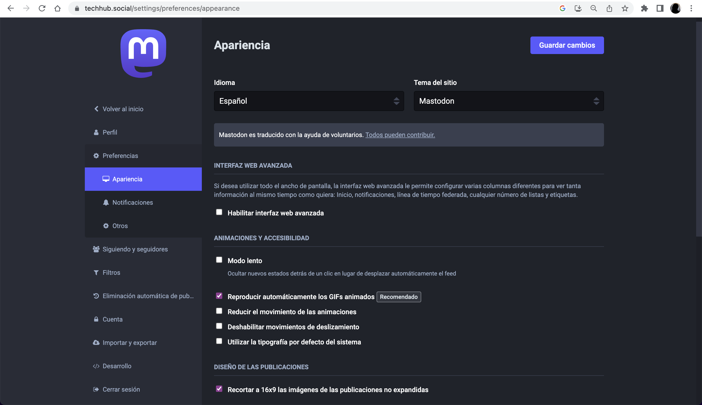
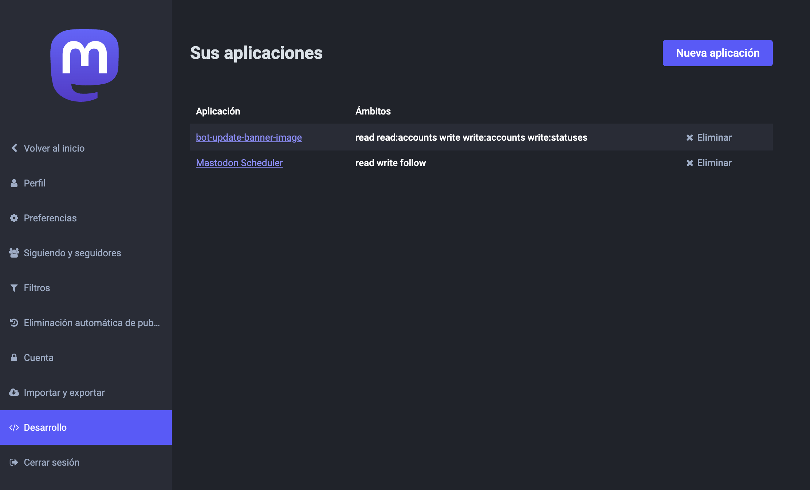
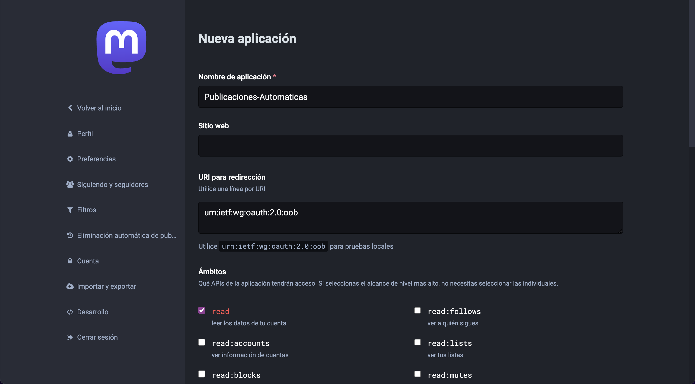
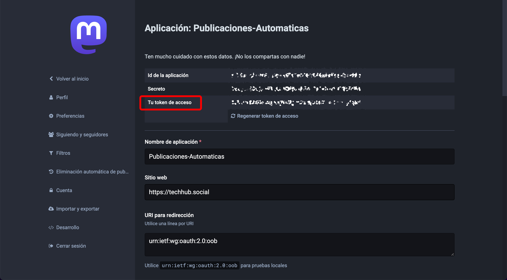
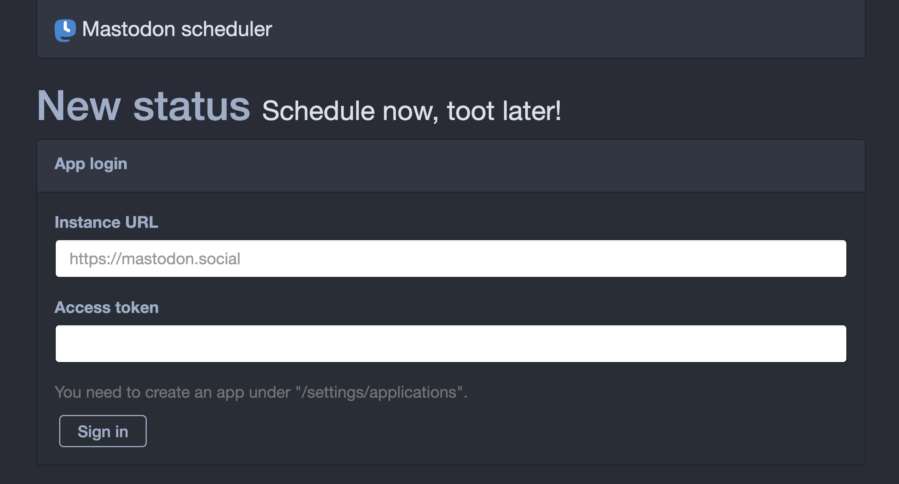
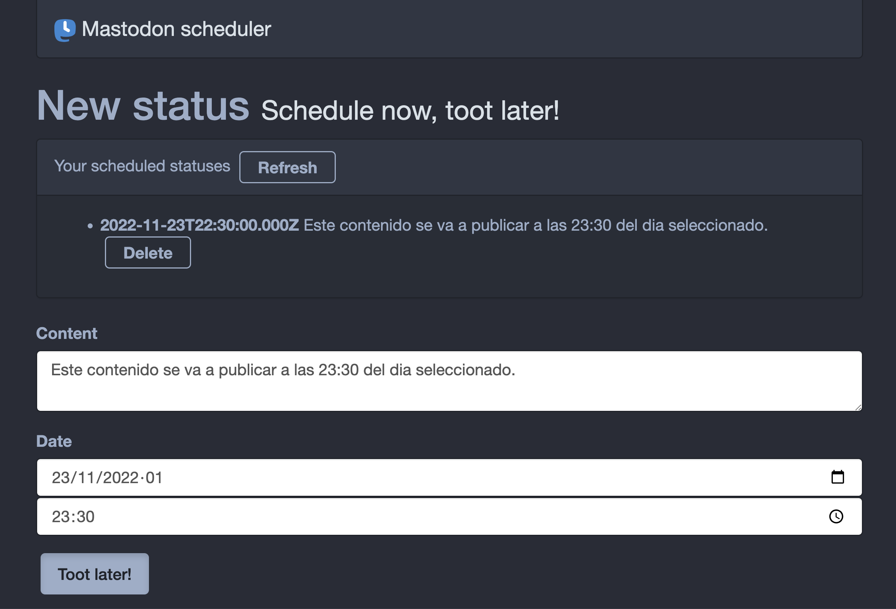

Una de las cosas que más extraño en Mastodon, que sí tiene Twitter, es la funcionalidad de programar publicaciones de manera nativa, es decir, publicaciones que se publiquen automáticamente en una fecha determinada.

Si acabas de aterrizar en [Mastodon](https://techhub.social/@baumannzone) porque vienes de Twitter, seguro que estás acostumbrado a usar la funcionalidad de programar publicaciones, tanto de manera nativa como con herramientas de terceros.

Programar el contenido de tus redes sociales es algo que deberías hacer si creas contenido. Sin embargo, con Mastodon la cosa no es tan fácil: Mastodon no te permite programar publicaciones automáticas de manera nativa. Esto no quiere decir que no se pueda.

En este artículo te voy a explicar **cómo configurar Mastodon** para poder programar publicaciones automáticas.

Para programar publicaciones en Mastodon, hay que utilizar una aplicación de terceros llamada _Mastodon Scheduler_.
Mastodon Scheduler no es tan user friendly como otras herramientas de programación de contenido, pero si sigues los pasos que te muestro a continuación, lo tendrás configurado en 2 minutos. 

## Crear la aplicación en Mastodon

Para poder programar publicaciones en Mastodon, lo primero que tienes que hacer es crear una aplicación en Mastodon. Para ello, accede a sección de **Desarrollo** en la página de preferencias de tu cuenta de Mastodon.

Una vez en la sección de desarrollo, haz clic en **Nueva aplicación**.

Rellena el campo **Nombre de aplicación** con el nombre que quieras. Yo he puesto "_Publicaciones-Automaticas_".

En el campo **Sitio web** pon la dirección del servidor de Mastodon con el que te has registrado. En mi caso `https://techhub.social`.  

El campo **URI para redirección** déjalo como está. Baja y dale al botón de **Envíar**.

Una vez creada la aplicación, verás el siguiente mensaje: "_La aplicación se ha creado correctamente_".  
Haz clic en el nombre de la aplicación que acabas de crear para entrar y ver los detalles. 

## Obtener el token de acceso

En la página de detalles de la aplicación, verás un campo llamado **Token de acceso**. Cópialo y guárdalo en un lugar seguro. 🔓 ¡No lo compartas con nadie! De lo contrario, podrían publicar contenido en tu nombre.

## Configurar Mastodon Scheduler

Entra en la aplicación online [Mastodon Scheduler](https://www.scheduler.mastodon.tools/). Este es el servicio que utilizaremos para programar todos nuestros futuros posts en Mastodon. 

En la página de inicio, verás un formulario con los siguientes campos:

- **Instance URL**: el dominio de tu servidor de Mastodon. En mi caso `techhub.social`.
- **Access Token**: el token de acceso que acabas de copiar de la aplicación de Mastodon.

Rellena los campos con los datos que has obtenido en los pasos anteriores. Una vez rellenados, haz clic en el botón **Sign in**.

Una vez hayas iniciado sesión, ya tendrás todo configurado para programar publicaciones en Mastodon.

Ahora solo tienes que escribir el contenido de tu publicación y programarla para que se publique en la fecha y hora que quieras.

Repite este proceso tantas veces como quieras para programar todas las publicaciones que necesites.

## Conclusión

Como ves, programar publicaciones en Mastodon no es tan complicado como parece. Con esta guía, ya sabes cómo hacerlo. Espero que pronto Mastodon incorpore esta funcionalidad de manera nativa. Mientras tanto, esta aplicación es una buena alternativa.

Si te ha gustado este artículo, compártelo con tus amigos y compañeros de trabajo. Si tienes alguna duda, puedes dejar un comentario abajo en la sección de comentarios o contactar conmigo en [Instagram](https://instagram.com/baumannzone).

¡Happy tooting!
