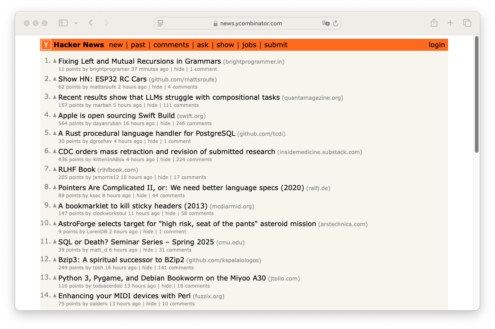
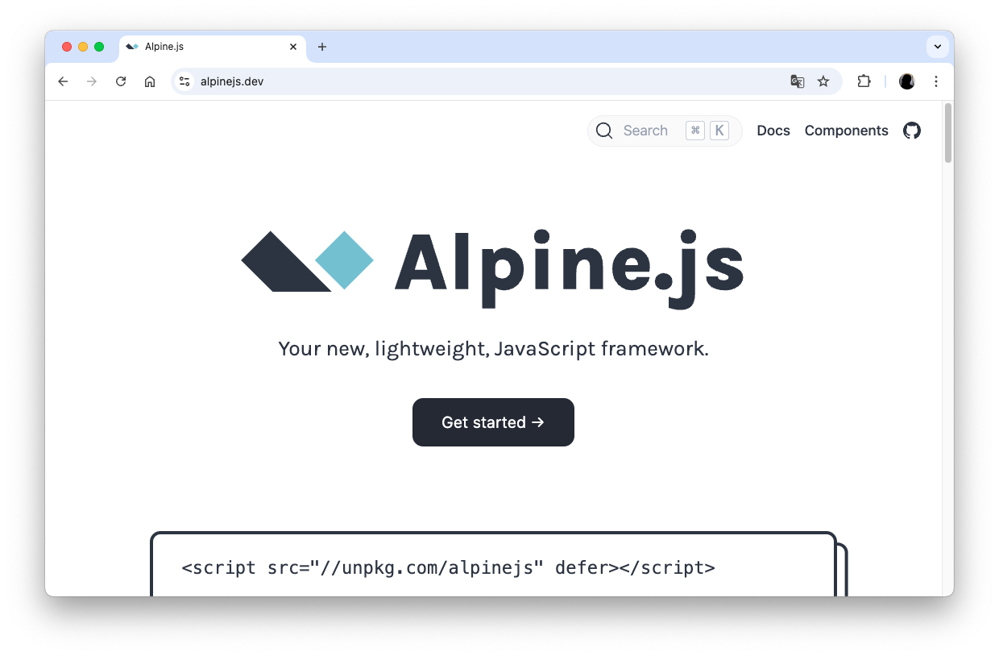
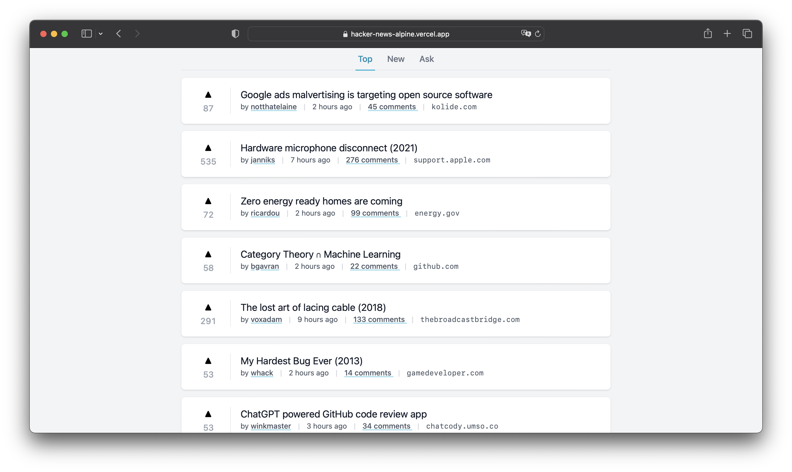

En este artículo, te contaré cómo creé un clon de **Hacker News** utilizando **Alpine.js** y **Tailwind CSS**. ¡Vamos a ello!

## Introducción

Hace unos meses decidí crear un clon de Hacker News, la famosa plataforma de noticias y discusión sobre tecnología. Mi objetivo era hacerlo simple, minimalista y funcional, utilizando herramientas modernas pero ligeras. Para ello, elegí dos tecnologías que me encantan: Alpine.js y Tailwind CSS.

## ¿Qué es Hacker News?

Hacker News es una página web de noticias y discusión de tecnología. Fue creada por Paul Graham en 2007 y es una de las páginas web más populares de la red. En ella se publican noticias sobre tecnología, programación, ciencia, etc. y se pueden comentar y votar.

🔗 https://news.ycombinator.com/

## Alpine.js

Alpine.js es un framework JavaScript ligero y de bajo nivel que te permite crear componentes reactivos sin necesidad de escribir código JavaScript. Es una alternativa a frameworks como React, Vue o Angular.

Su principal ventaja es que es muy fácil de aprender y de utilizar. Su sintaxis es muy similar a la de Vue.js o Angular, por lo que si ya conoces alguno de estos frameworks, aprenderás Alpine.js en muy poco tiempo.

🔗 https://alpinejs.dev/

## Tailwind CSS

Tailwind CSS es un framework de CSS _utility-first_ que te permite construir interfaces directamente en tu HTML, solo con clases de CSS. Con Tailwind, puedes crear diseños complejos sin escribir CSS personalizado, lo que acelera mucho el desarrollo.

🔗 https://tailwindcss.com/

## El proyecto: Un clon de Hacker News

El proyecto está alojado en GitHub y es completamente open source. Puedes ver el código aquí: [baumannzone/hacker-news-alpine](https://github.com/baumannzone/hacker-news-alpine).

En este proyecto, estoy utilizando una **API real** para obtener los datos de Hacker News. Aunque no es la API oficial (es demasiado compleja para este proyecto), la que estoy usando es una alternativa más sencilla y práctica: la API proporcionada por [tastejs/hacker-news-pwas](https://github.com/tastejs/hacker-news-pwas/blob/master/docs/api.md). Esta API es fácil de integrar y ofrece toda la funcionalidad necesaria para mostrar las noticias más populares y sus detalles.

### Características principales

- Interfaz minimalista y moderna: El sitio web original de Hacker News se ve bastante anticuado, así que decidí darle un toque más moderno y minimalista.
- Responsive: Funciona perfectamente en dispositivos móviles y en desktop.
- Paginación: Muestra las noticias en páginas de 30 en 30.

### Tecnologías utilizadas

- Alpine.js
- Tailwind CSS
- Vercel: Despliegue y [hosting](https://hacker-news-alpine.vercel.app/).
- [API](https://github.com/tastejs/hacker-news-pwas/blob/master/docs/api.md) no oficial: Para obtener las noticias.

### Cómo funciona

El proyecto consume la API pública de Hacker News para obtener las noticias más recientes y mostrarlas en una interfaz sencilla. Alpine.js se encarga de manejar el estado y la interactividad, mientras que Tailwind CSS se utiliza para darle estilo a la aplicación.

Si haces clic en una noticia, se abre una nueva ventana con los detalles de la noticia.
Si haces click en los comentarios, navegas a la página de comentarios de la noticia dentro de la aplicación.

## Conclusión

Hacía tiempo que quería crear un clon de Hacker News, ¡y por fin lo hice! ¿Quieres crear algo rápido, minimalista y potente? **Alpine.js** y **Tailwind CSS** son tu combo ganador. Este clon de Hacker News es la prueba: ligero, moderno y funcional en tiempo récord.

¿Te animas a probarlo? Clona el repo [aquí](https://github.com/baumannzone/hacker-news-alpine) o échale un vistazo en vivo [aquí](https://hacker-news-alpine.vercel.app/).

👉 ¿Te gustó? 🤩 ¡Dame una estrellita en GitHub!
