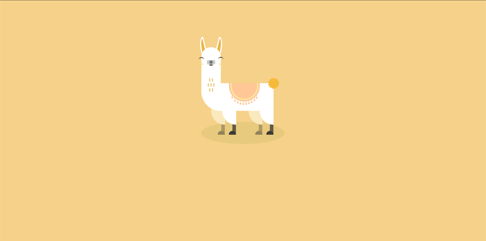
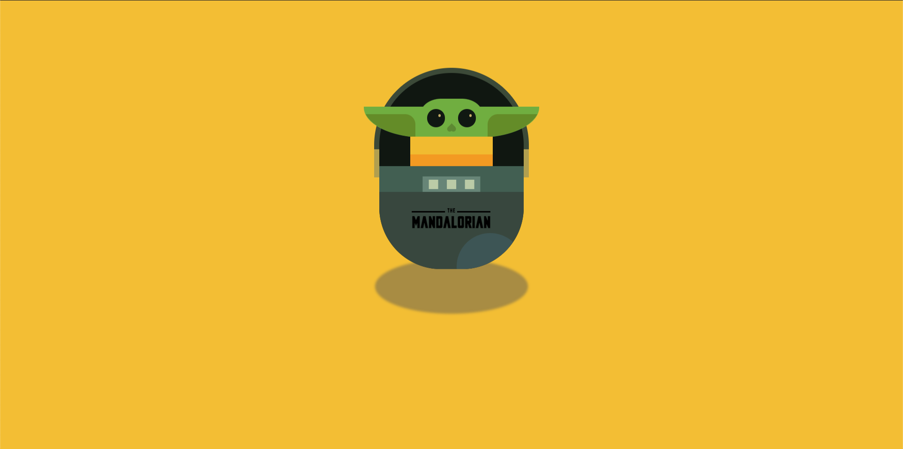
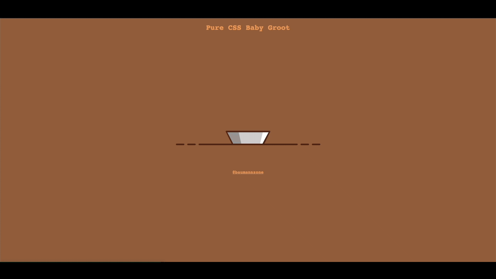
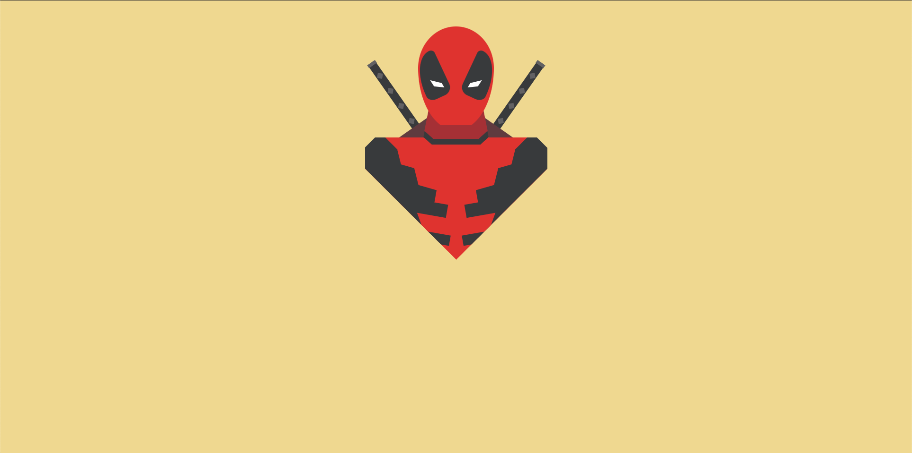
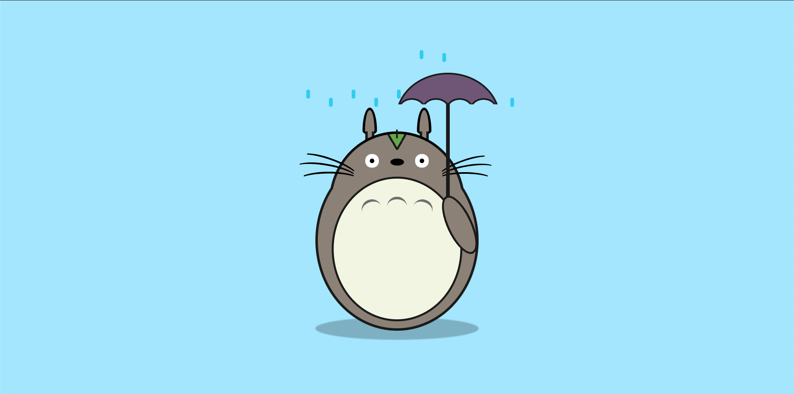
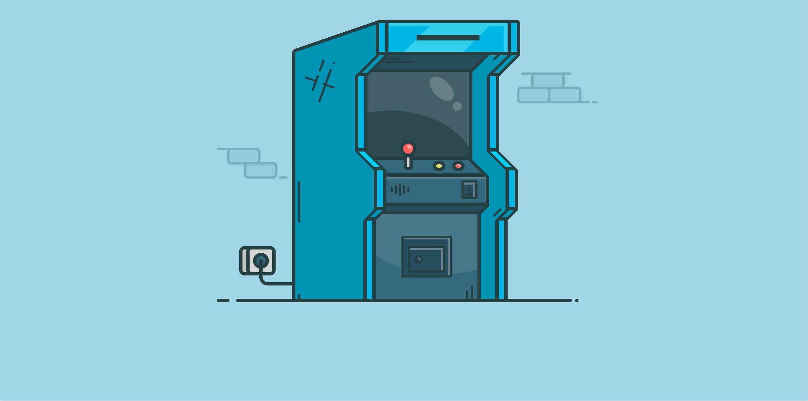
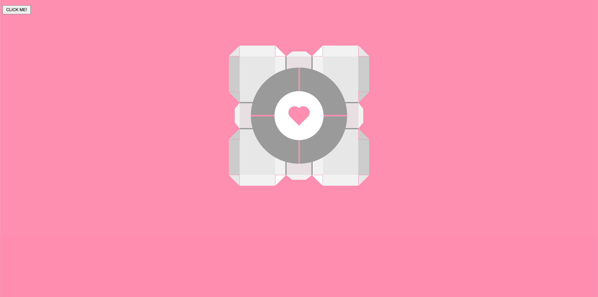
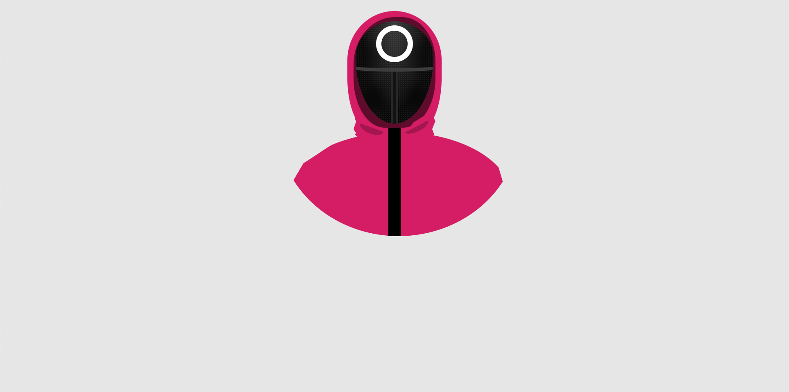

Oh, **"dibujar con CSS"**, sí, por supuesto. Esa grandiosa idea de hacer que tu navegador se parezca más a un lienzo de Picasso que a un sitio web. Es básicamente como coger un martillo para ajustar un reloj. Puede funcionar, pero ¿es realmente la herramienta correcta para el trabajo?

Entonces, ¿qué significa "dibujar con CSS"? Bueno, es sencillo: haces arte con un lenguaje diseñado para darle estilo a documentos, no para ser un pincel. Usas Cascading Style Sheets, para crear formas, colores y animaciones.

Claro, porque cuando piensas en CSS lo primero que se te viene a la cabeza es "_arte_" y no "_ayuda, ¿por qué este `<div>` no está centrado?_".

## ¿Cómo dibujas con CSS?
Imagínate crear un cuadrado. En vez de usar una herramienta de diseño gráfico donde puedes dibujar un cuadrado en unos segundos, te lanzas al sin fin de las propiedades de CSS. Entonces acabas con algo así:

```html
<style>
.square {
  width: 100px;
  height: 100px;
  background-color: #ff0000;
}
</style>

<div class="square"></div>
```

¡Ahí lo tienes, un cuadrado rojo de 100x100 píxeles! Impresionante. ¡Una obra maestra! Seguro que nadie podría haberlo hecho con una herramienta de diseño en dos clics.

Ahora solo tienes que repetir este proceso unas 1733 veces para crear una ilustración sencilla. Frustrarte porque no puedes hacer que un elemento se ponga detras de otro sin romper el dibujo. 

Cuando finalmente termines, te darás cuenta de que no puedes cambiar el tamaño de la ilustración sin tener que reescribir todo el código. Perfecto, ya está. ¡Has dibujado con CSS!

---

A pesar de todo, hay personas que disfrutan de este proceso. Les gusta crear arte con CSS. Debo confesar que yo soy una de esas personas.

Dibujar con CSS ¡es super fácil! Solo necesitas dominar un millón de propiedades y funciones de CSS diferentes, entender completamente cómo interactúan entre sí y luego, solo entonces, podrás dibujar una ilustración sencilla que podría haberse hecho en 5 minutos con cualquier programa de diseño. Molón, ¿verdad?

## ¿Por qué dibujas con CSS?
No olvidemos el verdadero espíritu detrás de este desafío, la razón principal por la 
que decidimos enfrentarnos a latempestad de divs y selectores: **se trata de hackear el lenguaje**.

Se trata de coger este humilde instrumento y decir: "_puedes ser más que un color de fondo, puedes ser arte_". No te conformes con tus fronteras, CSS.

Como artistas de CSS, llevamos el lenguaje más allá de sus convencionalismos y lo sumergimos en la euforia de lo absurdo. Cada `<div>` se convierte en una prueba para los límites de tu creatividad.

Somos hackers desafiando las reglas, explorando las posibilidades y forzando a un lenguaje diseñado para lo mundano a convertirse en algo mágico.

Cuando veas una ilustración de _La Gioconda_ hecha con puro CSS, recuerda, no estás viendo solo una imagen. Estás viendo las huellas de un hacker, una mente que se negó a aceptar los límites. Un ser irónico e incluso masoquista (sobre todo eso), pero también valiente y deslumbrante. 

Así es cómo veo yo realmente el arte de "dibujar con CSS".

## Estrategias para dibujar con CSS
- **Sin restricciones**: dibuja como quieras. No hay reglas. Solo hazlo.
- **Code Golfing**: intenta hacer la ilustración con la menor cantidad de código posible. Por lo general es el más usado.
- **1 Div**: intenta hacer la ilustración con un solo `<div>`.
- **No Div**: un paso más. Intenta hacer la ilustración sin usar ningún `div`, solo con el elemento `<body>`.

---

## Algunos ejemplos
Aquí tienes algunos ejemplos de dibujos con CSS que he hecho a lo largo de los años. La mayoria son animados, así que te recomiendo que los veas en Instagram:

- Pure CSS Alpaca: https://www.instagram.com/p/CLAmQbwqsdl/
  

- Pure CSS Baby Yoda: https://www.instagram.com/p/CL4wOUisfzz/
  

- Pure CSS Baby Groot: https://www.instagram.com/p/CMMFY6rI7XB/
  

- Pure CSS Deadpool: https://www.instagram.com/p/CMvH7xsqubq/
  

- Pure CSS Totoro: https://www.instagram.com/p/CNn2TizKMx3/
  

- Pure CSS Viking: https://www.instagram.com/p/COLCLo5qPH1/
  

- Pure CSS Arcade Machine: https://www.instagram.com/p/CPMQztrD05t/
  
  Lee el artículo completo aquí: [Pure CSS Arcade Machine](/blog/pure-css-arcade-machine/)

- Pure CSS Portal Cube: https://www.instagram.com/p/CR3TOJXqmni/
  

- Pure CSS Squid Game Soldier: https://codepen.io/baumannzone/full/NWvyZgy
  

Por ultimo, un listado de proyectos en codepen con algunos de los mejores dibujos con CSS que he hecho: https://codepen.io/collection/AOYoNV

## ¿Quién más dibuja con CSS?
Somos pocos, pero aquí tienes algunas cuentas que te recomiendo seguir si te interesan los dibujos con CSS (**SPOILER**: lo vas a flipar):

- Jhey: https://x.com/jh3yy
- Carmen Ansio: https://x.com/carmenansio
- T. Afif: https://x.com/ChallengesCss
- Alvaro Montoro: https://x.com/alvaro_montoro
- Kass: https://x.com/KassandraSanch
- Manz: https://x.com/manz
- Baumannzone: https://x.com/baumannzone

¿Conoces a alguien más? ¡Déjalo en los comentarios!

Dibujar con CSS: una excelente forma de demostrar tus habilidades de CSS, volverte loco en el proceso y probablemente cuestionarte tus decisiones de vida. Pero, al final del día, es una forma de arte y una forma de expresión. ¡Así que sigue dibujando!

--- 

Espero que este post te haya inspirado a adentrarte en el arte de "dibujar con CSS" y te motive a embarcarte en tu propia aventura creativa. Recuerda, ¡CSS Art no tiene límites!


<small>**Extra**: enlace a La Gioconda en CSS: https://codepen.io/jaysalvat/full/kazzOj</small>
