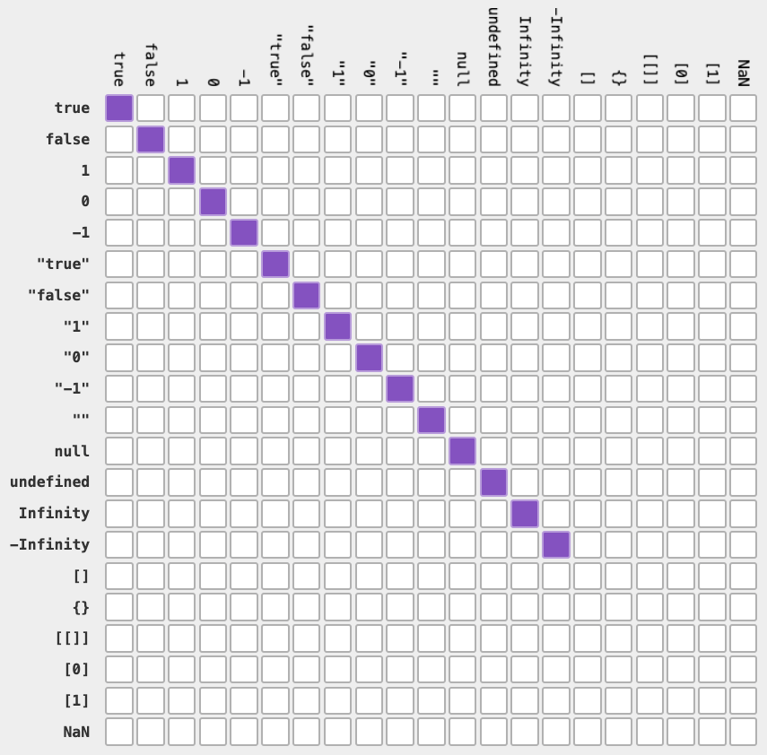
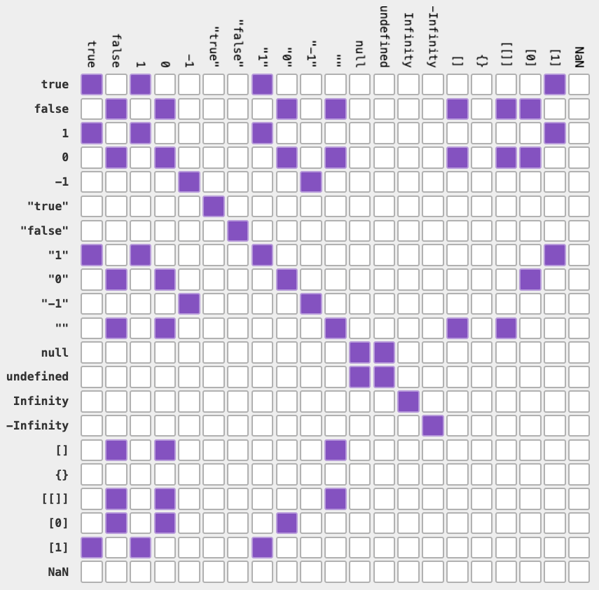

Cuando trabajamos con JavaScript, una de las decisiones más importantes que debemos tomar es qué operador de igualdad usar: `==` o `===`. Aunque ambos sirven para comparar valores, tienen comportamientos muy diferentes que pueden afectar significativamente a nuestro código. En este artículo, te voy a explicar la diferencia entre ambos y cuándo usar cada uno.

## TL;DR dogmático

Usa siempre `===` y olvídate de `==`.

## El operador de igualdad estricta (`===`)

Cuando usas el triple igual `===`, hay dos reglas que debes recordar:

- **Igualdad estricta**: cuando comparas valores primitivos.
- **Igualdad por referencia**: cuando comparas valores por referencia.

Sí, suena simple... hasta que comparas dos arrays vacíos y te preguntas por qué JavaScript te odia.

El operador `===` (triple igual) es conocido como el **operador de igualdad estricta**. Este operador compara tanto el valor como el tipo de dato de los operandos. Solo devuelve `true` si ambos son exactamente iguales.

### Igualdad estricta

La igualdad estricta verifica que tanto el tipo (`number`, `string`, `boolean`, etc.) como el valor sean iguales.

- Si el **tipo** es el mismo pero el **valor** no, obtendrás `false`.
- Si el **valor** es el mismo pero el **tipo** no, también obtendrás `false`.
- Solo si el **tipo** y el **valor** son exactamente iguales, obtendrás `true`.

```javascript
10 === 10; // true. Mismo tipo, mismo valor.
10 === 20; // false. Mismo tipo, valor diferente.
10 === "10"; // false. Distinto tipo, mismo valor.

false === false; // true. Mismo tipo, mismo valor.
false === true; // false. Mismo tipo, distinto valor.
false === "false"; // false. Distinto tipo, mismo valor.
```

Parece lo bastante simple, pero como mencionamos antes, esta regla se rompe cuando empezamos a comparar valores por referencia (o sea, valores que no son primitivos).

### Igualdad por referencia

Como vimos en el ejemplo anterior, los primitivos se comparan por su valor. Sin embargo, si usas el triple igual con valores por referencia, lo que se compara son las referencias (es decir, las ubicaciones en memoria).

```javascript
{} === {} // false. Mismo tipo, valor similar, diferente referencia. ❌
[] === [] // false. Mismo tipo, valor similar, diferente referencia. ❌
{ age: 1 } === { age: 1 } // false. Mismo tipo, valor similar, diferente referencia. ❌
```

Aunque cada uno de los ejemplos anteriores tiene el mismo tipo y lo que parece ser el mismo valor, como son valores por referencia, JavaScript compara las referencias en memoria, no el valor en sí.
En todos los casos, las referencias (o ubicaciones en memoria) son distintas, por eso siempre obtenemos `false`.

Podemos ver esto más claramente si asignamos dos variables a la misma referencia en memoria y luego usamos el operador de identidad entre ellas.

```javascript
const obj1 = {
  dog: "Rambo",
};
const obj2 = obj1;

obj1 === obj2; // true. Mismo tipo, valor similar, misma referencia. ✅
```

En el ejemplo, tanto `obj1` como `obj2` están haciendo referencia al mismo lugar en memoria, por eso obtenemos `true`.

En resumen, cuando usas el operador de identidad (`===`), suponiendo que ya entendiste esto de la igualdad por referencia, todo funciona como esperarías.

Aquí tienes una tabla de igualdad triple igual para que parezca que todo en JavaScript tiene sentido:



---

## El operador de igualdad abstracta (`==`)

Lo más probable es que el operador de igualdad (doble igual, `==`) no se comporte como esperas, a diferencia del operador de identidad (triple igual, `===`).

Aquí tienes solo algunos ejemplos para que empieces a desconfiar de todo:

```javascript
"1" == 1; // true
true == 0; // true
null == undefined; // true
0 == ""; // true
"0" == false; // true
[1] == true; // true
```

**¿Qué? ¿Por qué? ¿Cómo? ¿Por qué JavaScript es tan raro?** 🤔

Fíjate que cada comparación se hace entre tipos diferentes.
Como vimos antes con el operador de identidad (`===`), todas estas comparaciones devolverían `false`, ya que los tipos no coinciden.

Sin embargo, el operador `==` (doble igual) tiene sus propias ideas sobre cómo deberían funcionar las cosas: ignora el sentido común y realiza una conversión de tipo (_type coercion_) antes de comparar.

Esto puede dar lugar a resultados inesperados, especialmente si no entiendes bien cómo y cuándo hace esa conversión.

Por lo tanto, en el ejemplo anterior ("1" == 1) el motor de JavaScript convierte la cadena `"1"` al número `1`, lo que luego se evalúa como `1 == 1`, y eso da `true`. Lo mismo pasa si uno es booleano, convierte el booleano a número (true = 1, false = 0).

Es esa etapa de coerción de tipos la que hace que el operador de igualdad (`==`) sea tan impredecible como tus decisiones de diseño.

Aquí tienes la misma tabla de igualdad que vimos antes, pero ahora bajo el operador de igualdad (`==`):



## Conclusión

En el universo de JavaScript, donde todo puede ser un número, una cadena o una mentira disfrazada de `true`, hay dos caminos: el del doble igual (`==`) y el del triple igual (`===`).

Si valoras tu tiempo y el respeto de tus compañeros de equipo, usa siempre el triple igual (`===`).

¿Y tú? ¿Qué operador prefieres usar en tu código? ¿Tienes algún caso de uso específico donde prefieras usar `==`? ¡Déjame tu opinión en los comentarios! 👇
