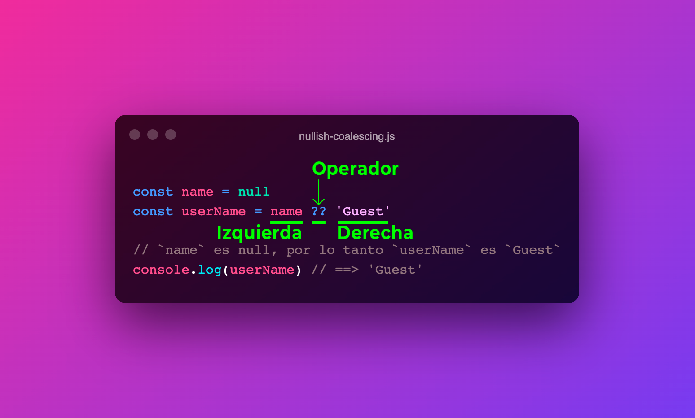

Si quieres saber cómo funciona el operador de doble signo de interrogación `??` (también conocido como operador de **Fusión Nula** o **Nullish Coalescing** operator) en JavaScript, esta guía es para ti.

El operador de doble signo de interrogación `??` es un operador de JavaScript que devuelve la expresión del lado derecho del operador cuando la expresión del lado izquierdo es `null` o `undefined`. En caso contrario, devuelve la expresión del lado izquierdo.  



Si `name` (_izquierda_) es `null` o `undefined`, devuelve `Guest` (_derecha_); en caso contrario, devuelve `name` (_izquierda_).

Aunque el operador de Nullish Coalescing se parece al operador ternario (`?`) de JavaScript, no tiene nada que ver, son operadores totalmente diferentes.

```javascript
const name = null
const userName = name ?? 'Guest'
```

Fue añadido en la versión **ES2020** de JavaScript, y es una forma de evitar el uso de `if` anidados en JavaScript. Es muy útil cuando queremos obtener el valor de una expresión, pero no sabemos si el valor de la expresión es `null` o `undefined`. Además, nos permite asignar un valor por defecto a una expresión.

Este operador es relativamente nuevo, sin embargo este operador solo es una forma más amigable de escribir lo siguiente:

```javascript
const userName = (name !== null && name !== undefined) ? name : 'Guest';
```

Desde mi punto de vista, el operador de nullish coalescing es más útil que el operador ternario, porque nos permite escribir menos código y es más fácil de leer.

Se diferencia del operador lógico _OR_ `||` en que los resultados _falsy_ son ignorados, excepto los recién mencionados valores `null` y `undefined`.

Los valores falsy son:

- `0`, `-0`
- `''`, `""` (cualquier cadena vacía)
- `NaN`
- `false`
- `null`
- `undefined`

Ejemplo usando el operador lógico _OR_ (`||`):

```javascript
0 || 'RambitoJs' // ==> 'RambitoJs'
'' || 'RambitoJs' // ==> 'RambitoJs'
NaN || 'RambitoJs' // ==> 'RambitoJs'
false || 'RambitoJs' // ==> 'RambitoJs'

null || 'RambitoJs' // ==> 'RambitoJs'
undefined || 'RambitoJs' // ==> 'RambitoJs'
```

Ejemplo usando el operador de fusión nula (`??`):

```javascript
0 ?? 'RambitoJs' // ==> 0
'' ?? 'RambitoJs' // ==> ''
NaN ?? 'RambitoJs' // ==> NaN
false ?? 'RambitoJs' // ==> false

null ?? 'RambitoJs' // ==> 'RambitoJs'
undefined ?? 'RambitoJs' // ==> 'RambitoJs'
```

Este operador surge porque hay ocasiones en las que necesitas que `0` o `''` (valores _falsy_) sean valores válidos.
Al utilizar el operador de fusión nula, solo reemplazará exactamente los valores nulos e indefinidos con un valor definido.

## Fusión Nula y operadores lógicos OR y AND

Por motivos de seguridad, el doble signo de interrogación no se puede utilizar junto con los operadores OR (`||`) y AND (`&&`) de JavaScript sin un paréntesis `()` que los separe. En tal caso, se lanzará un error de tipo `SyntaxError`.

```javascript
null || undefined ?? 'RambitoJs'  // ==> SyntaxError
null && undefined ?? 'RambitoJs'  // ==> SyntaxError

// En ambos casos: Uncaught SyntaxError: Unexpected token '??'
```

Esto se debe a que JavaScript no sabe qué operador debe evaluar primero. Tienes que utilizar los paréntesis para indicar la prioridad de las evaluaciones.

Cuando le añades los paréntesis, el operador de fusión nula funciona correctamente porque evaluará primero las expresiones entre paréntesis:

```javascript
(null || undefined) ?? 'RambitoJs' // ==> 'RambitoJs'
(null && undefined) ?? 'RambitoJs' // ==> 'RambitoJs'
```

Al igual que con el operador lógico _OR_ (`||`) y con el operador lógico _AND_ (`&&`), el operador de fusión nula puede usarse varias veces en una misma expresión:

```javascript
const nickName = null
const fullName = null
const company = null
const userName = nickname ?? fullName ?? company ?? 'Anonymous'  // ==> 'Anonymous'
```

Esto es todo lo que necesitas saber del operador de doble interrogación (`??`) en JavaScript, también conocido como operador de Nullish Coalescing u operador de Fusión Nula.
