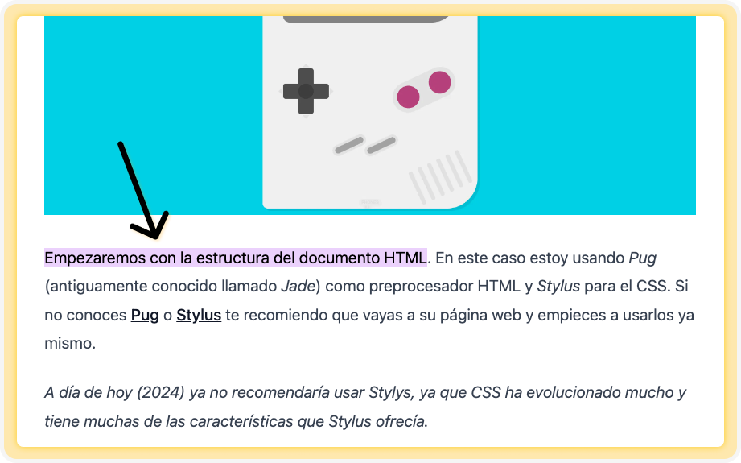
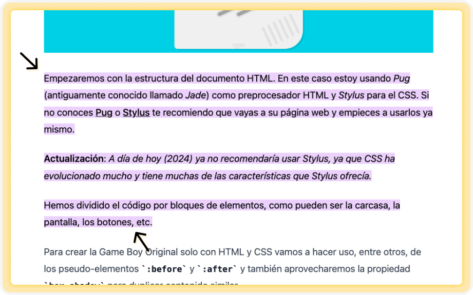
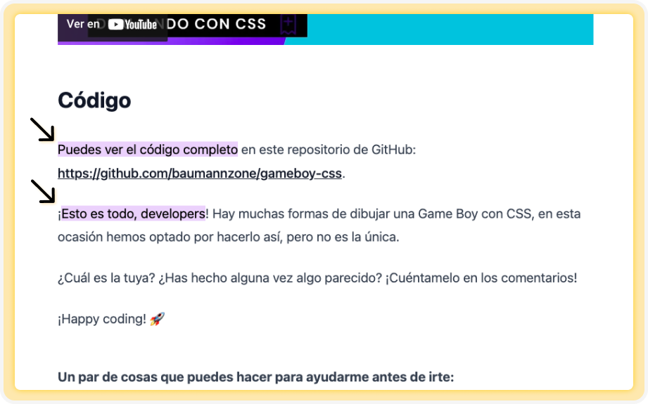
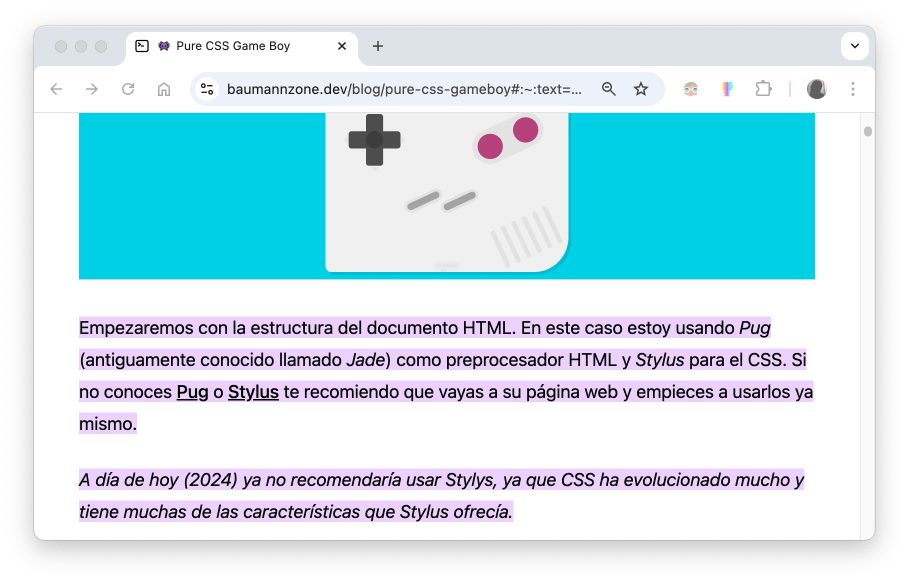
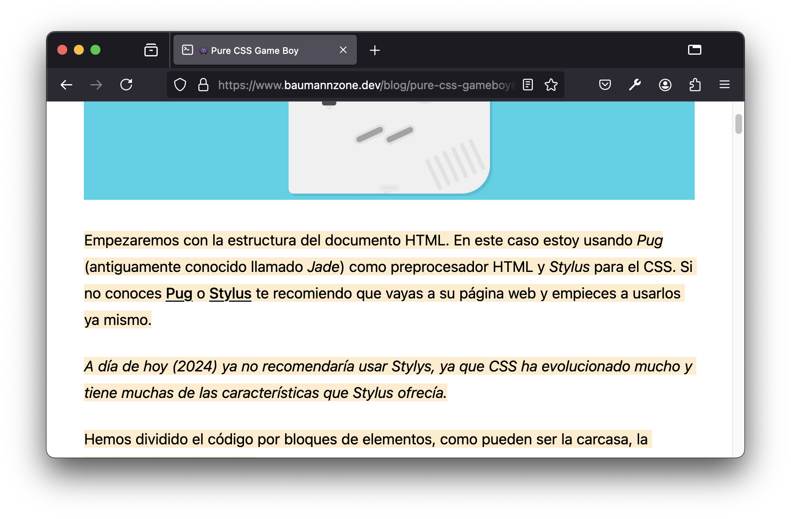
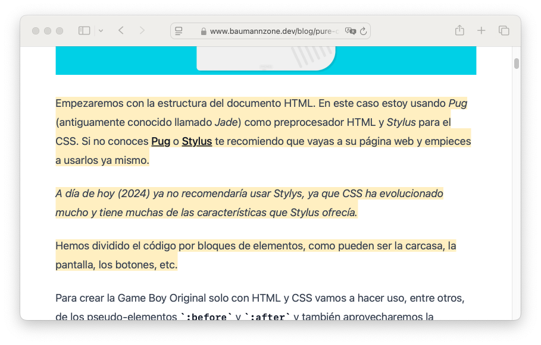
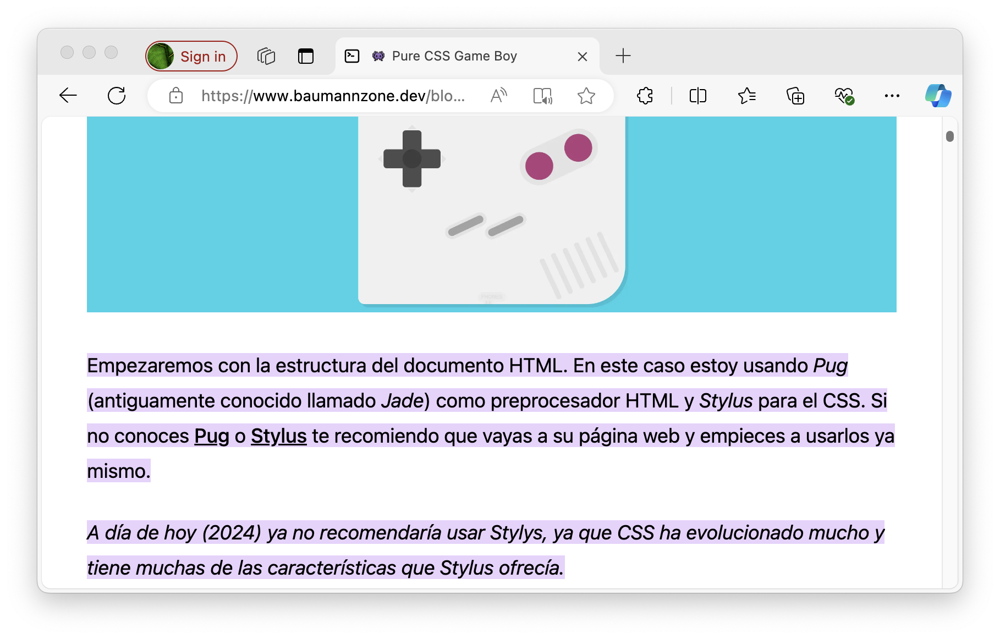
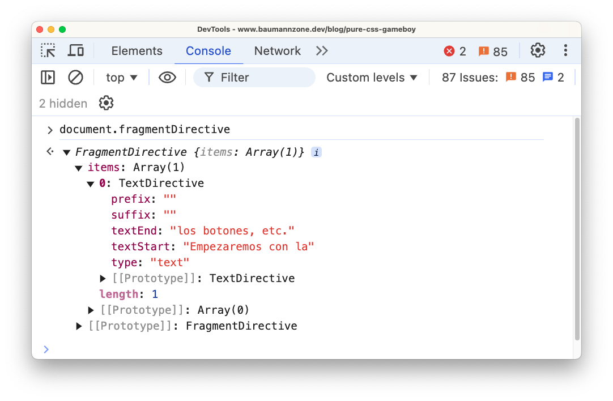
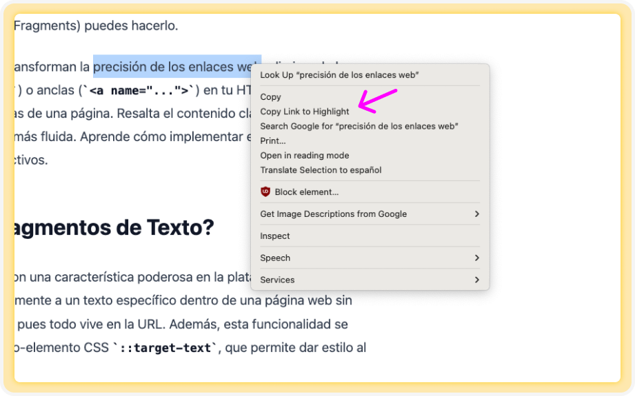

¿Alguna vez has querido compartir un enlace a un artículo o página web y dirigir a tus amigos directamente al fragmento de texto que te parece más interesante? Con los Fragmentos de Texto (Text Fragments) puedes hacerlo.

Los Fragmentos de Texto transforman la precisión de los enlaces web, eliminando la necesidad de tener IDs (`#`) o anclas (`<a name="...">`) en tu HTML para dirigir a los usuarios a partes específicas de una página. Resalta el contenido clave y ofrece una experiencia de navegación más fluida. Aprende cómo implementar esta técnica y crea enlaces más directos y efectivos.

## ¿Qué son los Fragmentos de Texto?

Los Fragmentos de Texto son una característica poderosa en la plataforma web moderna que permite enlazar directamente a un texto específico dentro de una página web sin necesidad de añadir lógica, pues todo vive en la URL. Además, esta funcionalidad se complementa con el pseudo-elemento CSS `::target-text`, que permite dar estilo al texto resaltado.

Los Fragmentos de Texto funcionan añadiendo una sintaxis especial al final de una URL (`#:~:text=`), similar a cómo agregamos el ID de un elemento en un enlace. El navegador interpreta esta parte de la URL, busca el texto especificado en la página y, si admite Fragmentos de Texto, se desplaza y resalta ese texto. Cuando el usuario navega usando la tecla Tab, el foco se moverá al siguiente elemento después del fragmento.

## ¿Cómo se usan los Fragmentos de Texto?

La sintaxis básica para una URL con Fragmento de Texto es la siguiente:

```
ejemplo.com/pagina.html#:~:text=[prefijo-,]inicioTexto[,finTexto][,-sufijo]
```

Después del símbolo de almohadilla `#`, añadimos la sintaxis especial `:~:` llamada fragment directive, seguida de `text=` y los siguientes parámetros opcionales:

- `prefijo-`: Texto que precede inmediatamente al contenido deseado, útil para cuando existen múltiples coincidencias (no se resalta).
- `inicioTexto`: El texto de inicio que quieres resaltar.
- `finTexto`: El texto final (opcional) para delimitar el fragmento resaltado.
- `-sufijo`: Similar al prefijo pero colocado después del texto, ideal cuando hay varias coincidencias (tampoco se resalta).

Por ejemplo, si queremos enlazar a un artículo sobre la Game Boy con CSS puro y resaltar la sección de la estructura HTML, la URL sería:

```
baumannzone.dev/blog/pure-css-gameboy#:~:text=Empezaremos%20con%20la%20estructura%20del%20documento%20HTML
```

En este caso, el fragmento de texto resaltado es "_Empezaremos con la estructura del documento HTML_" (codificado). Si sigues [el enlace](https://www.baumannzone.dev/blog/pure-css-gameboy#:~:text=Empezaremos%20con%20la%20estructura%20del%20documento%20HTML), el navegador buscará ese texto en la página y lo resaltará. Así es como se ve en **Chrome**:



### Rangos de fragmentos de texto

Si el texto que vas a resaltar es muy largo, puedes resaltar un rango de texto especificando tanto el texto inicial como el final, separados por una coma.

```
baumannzone.dev/blog/pure-css-gameboy#:~:text=Empezaremos%20con%20la,los%20botones%2C%20etc.
```

Aquí el fragmento resaltado va desde "_Empezaremos con la_" hasta "_los botones, etc._".

Si sigues [este link](https://www.baumannzone.dev/blog/pure-css-gameboy#:~:text=Empezaremos%20con%20la,los%20botones%2C%20etc.), deberías ver algo como esto:



### Múltiples fragmentos de texto

Si quieres resaltar múltiples fragmentos de texto, puedes hacerlo usando el ampersand `&` para separar cada fragmento de texto.

```
baumannzone.dev/blog/pure-css-gameboy#:~:text=Puedes%20ver%20el%20c%C3%B3digo%20completo&text=Esto%20es%20todo%2c%20developers
```

En este caso, se resaltarán dos fragmentos de texto: "_Puedes ver el código completo_" y "_Esto es todo, developers_". En [este enlace](https://www.baumannzone.dev/blog/pure-css-gameboy#:~:text=Puedes%20ver%20el%20c%C3%B3digo%20completo&text=Esto%20es%20todo%2c%20developers) se ve así:



Otro comportamientos interesante de los Fragmentos de Texto es que, si enlazamos a contenido oculto que puede ser descubierto mediante la función de búsqueda (por ejemplo, un elemento `details` / `summary` cerrado), el contenido oculto se hará visible, aunque esto puede variar según el navegador.

## Dar estilo a los Fragmentos de Texto

El pseudo-elemento CSS `::target-text` representa el texto al que se ha desplazado si tu navegador admite fragmentos de texto. Permite a los developers decidir cómo resaltar esa sección de texto.

```css
::target-text {
  background-color: gold;
}
```

Con este código, el texto resaltado por un fragmento de texto se mostrará con un fondo dorado. Puedes personalizar los estilos según tus preferencias, pero ten en cuenta que solo puedes personalizar estas propiedades:

- `color`
- `background-color`
- `text-decoration`
- `text-shadow`
- `stroke-color`, `fill-color` y `stroke-width`

## Soporte en navegadores

Actualmente los fragmentos de texto son compatibles con la mayoría de los navegadores principales. No obstante, el pseudo-elemento `::target-text` aún no está disponible en Safari, aunque ya está incluido en su versión beta, Technology Preview.

Si un navegador no soporta esta función, simplemente cargará la página sin resaltar o desplazar el texto.

La apariencia predeterminada del resaltado varía entre navegadores. Safari resalta el área completa de la línea, mientras que Firefox, Edge y Chrome solo resaltan el texto, dejando espacios vacíos entre líneas.

**Chrome**


**Firefox Developer Edition**


**Safari**


**Edge**


Desde JavaScript puedes verificar si el navegador soporta esta característica usando `document.fragmentDirective`. Si está soportado, devolverá un objeto `FragmentDirective`; en caso contrario, devolverá `undefined`.

```js
if ("fragmentDirective" in document) {
  // => Soportado
} else {
  // => No soportado
}
```

El objeto `FragmentDirective` tiene las los valores de las propiedades `prefix`, `suffix`, `textStart` y `textEnd`. Puedes acceder a ellos para obtener información sobre el fragmento de texto actual.



## Consideraciones prácticas

- Las cadenas de texto utilizadas para los valores de `textStart`, `textEnd`, `prefix-` y `-suffix` deben estar codificadas en URI.
- Los fragmentos de texto no son sensibles a mayúsculas y minúsculas.
- Por seguridad, es necesario agregar `rel="noopener"` a tus elementos `<a>`.
- Los fragmentos de texto solo funcionan en el documento principal. No funcionarán dentro de un `<iframe>`.

Una característica interesante que tiene Google Chrome es que puedes copiar el enlace con el fragmento de texto resaltado directamente desde el navegador. Solo tienes que hacer clic derecho en el texto resaltado y seleccionar "_Copiar enlace al texto destacado_" o "_Copy Link to Highlight_".



## Notas finales

La primera vez que vi los fragmentos de texto fue en los resultados de búsqueda de Google, donde resaltan las palabras clave que buscas. Al principio pensaba que era una característica exclusiva de Google, pero me alegra saber que es una funcionalidad estándar en la web, disponible para cualquier navegador que decida implementarla.

¿Tú la conocías? ¿Te parece útil? Te leo.
