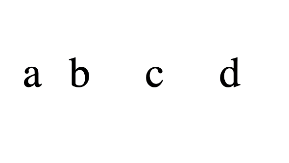

El espaciado de letras o letter-spacing en CSS parece una propiedad sencilla, ¿verdad? Ajustar el espacio entre letras no debería ser un problema. Pero te han mentido. Lo que parece inofensivo puede estar desmoronando la estética de tus diseños sin que lo notes.

Es probable que hayas estado usando mal el espaciado de letras todo este tiempo. Y lo peor es que este error pasa desapercibido para la mayoría de los desarrolladores y diseñadores. Sus efectos se manifiestan en la alineación y el ritmo visual de tus textos.

Pero no te preocupes, hoy entenderás por qué `letter-spacing` está roto en CSS.

## ¿Qué es `letter-spacing` en CSS?

La pregunta es obvia, pero vale la pena responderla. `letter-spacing` es una propiedad de CSS que te permite ajustar el espacio entre las letras de un texto. Puedes usar valores positivos o negativos para aumentar o disminuir el espacio entre las letras.

```css
h1 {
  letter-spacing: 16px;
}
```

En este caso, el espaciado entre las letras de todos los títulos `<h1>` será de `16px`. Si quieres reducir el espacio, puedes usar un valor más pequeño o un valor negativo:

```css
h1 {
  letter-spacing: -2px;
}
```

## ¿Por qué `letter-spacing` está roto?

La especificación dice lo siguiente: "_This property specifies additional spacing between adjacent typographic character units._" (traducido: "Esta propiedad especifica el espaciado adicional entre unidades de caracteres tipográficos adyacentes").

Por lo tanto, que si tienes este código HTML:

```html
<p>a<span>bc</span>d</p>
```

y este código CSS:

```css
p {
  letter-spacing: 1rem;
}

span {
  letter-spacing: 2rem;
}
```

El resultado debería ser algo así:


Es decir, que el espaciado entre las letras `a` y `b` y entre las letras `c` y `d` debería ser de `1rem` y entre las letras `b` y `c` debería ser de `2rem`.

Sin embargo, si ejecutas este código en Chrome, verás que el espacio entre las letras `c` y `d` también es de `2rem`:


Esto es un error en la implementación de la propiedad `letter-spacing` en los navegadores. En lugar de aplicar el espaciado solo entre las letras adyacentes, también lo aplica al final, por lo que el espaciado entre las letras `c` y `d` es de `2rem` en lugar de `1rem`.



## ¿Qué esperar en el futuro?

Desde el [CSSWG](https://github.com/w3c/csswg-drafts/issues/10193) ya han reconocido el problema y se espera que en futuras versiones se realicen mejoras para corregir este comportamiento, así que solo queda esperar y estar atentos a las actualizaciones.

Ahora ya sabes por qué `letter-spacing` está roto en CSS.
