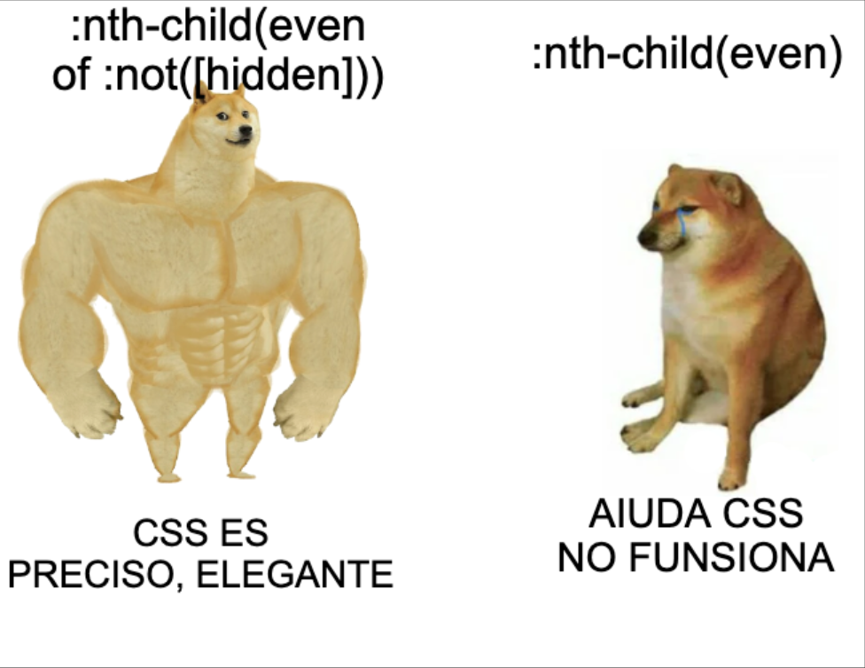

import Demo1 from "../../components/demos-blog/la-sintaxis-secreta-de-of-s-en-nth-child-que-probablemente-estas-ignorando/1.astro";
import Demo2 from "../../components/demos-blog/la-sintaxis-secreta-de-of-s-en-nth-child-que-probablemente-estas-ignorando/2.astro";

Una de las joyas escondidas en la caja de herramientas de CSS es la sintaxis matemática de `:nth-child()`. Mucha gente la usa con números simples como `:nth-child(2n)` y se queda ahí, sin saber que la fórmula acepta mucho más.

Hoy vamos a diseccionar la famosa fórmula `An+B` de CSS. Hoy vas a aprender a usar el selector `:nth-child()` con su nueva y mejorada sintaxis `of S`.

## TL;DR (para ir al grano)

```css
:nth-child(2 of .active) {
  color: red;
}
```

## `:nth-child(An+B)`

Ya conoces la sintaxis clásica de `:nth-child()`:

- `:nth-child(2)`: Selecciona el segundo elemento.
- `:nth-child(2n)`: Selecciona todos los elementos pares (2º, 4º, 6º, 8º, etc.).
- `:nth-child(2n+1)`: Selecciona todos los elementos impares (1º, 3º, 5º, 7º, etc.).

## ¿Qué es `of S`?

Cuando se especifica `of S`, la lógica `An+B` se aplica solo a los elementos que coinciden con la lista de selectores `S`.
Básicamente, esto significa que puedes prefiltrar los elementos hijos antes de que `An+B` entre en acción.

```css
tr:nth-child(2 of .active) {
  /* ... */
}
```

En este ejemplo, selecciona el segundo elemento que tenga la clase `.active`.
Dicho de otro modo, de entre todos los hijos con la clase `.active`, selecciona el segundo.

## Caso práctico: lista con elementos ocultos

Imagina que tienes seis elementos en una lista, pero dos están ocultos con el atributo `hidden`.

```html
<li>Elemento 1</li>
<li hidden>Elemento 2</li>
<li>Elemento 3</li>
<li>Elemento 4</li>
<li hidden>Elemento 5</li>
<li>Elemento 6</li>
```

Si usas el clásico `:nth-child(even)`:

```css
li:nth-child(even) {
  background-color: violet;
}
```

<Demo1 />

Se resaltarán los elementos en las posiciones **3** y **4** de la lista, es decir, los elementos **4** y **6** del HTML.
Esto ocurre porque incluso los elementos ocultos se tienen en cuenta al contar.

No es el resultado que esperarías si lo que quieres es **resaltar cada segundo elemento visible**.

## Entra en escena `of S`

Desde el 2023, la sintaxis `of S` de `:nth-child()` está disponible en todos los navegadores modernos.

Para solucionar este problema, puedes usar `of :not([hidden])`:

```css
li:nth-child(even of :not([hidden])) {
  background-color: violet;
}
```

<Demo2 />

Cronología:

1. Crea una lista de todos los elementos `<li>` que están visibles.
2. Aplica la regla `li:nth-child(even)` a los elementos de esta nueva lista.

Boom. Ahora sí: se resaltan solo los elementos visibles **1**, **3**, **4**, **6**, y se ignoran los `hidden`.

---

## Curiosidades

- Safari fue el primero en implementar esta sintaxis con el nombre `of S` en el 2015 (iOS y macOS).
- Esta sintaxis también es compatible con `:nth-last-child()`.


