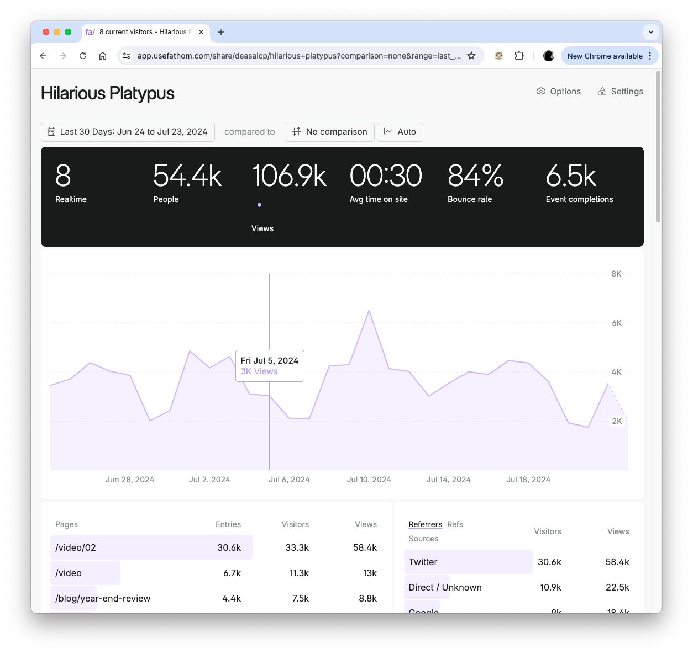

Durante años, Google Analytics ha sido mi herramienta favorita para analizar el tráfico de mis webs. Sin embargo, he decidido abandonarlo en favor de una alternativa más respetuosa con la privacidad: **Fathom Analytics**. Aquí te cuento por qué.

## El lado oscuro de Google Analytics
Google Analytics es popular por una razón: es gratuito y ofrece una gran cantidad de datos. Pero, ¿a qué precio? Cuando algo es gratis, **usualmente tú y tus usuarios sois el producto**. En el caso de Google Analytics, la privacidad de tus usuarios es el precio que pagas por usar la herramienta.

## La importancia de la privacidad
En la era digital, la privacidad es un bien preciado. Los usuarios confían en nosotros para proteger sus datos, y es nuestra responsabilidad hacerlo. Google Analytics no solo recolecta datos en masa, sino que también los comparte con terceros. ¿Realmente queremos ser cómplices de esto?

## Una alternativa respetuosa a Google Analytics
Decidí buscar una alternativa más ética y encontré Fathom Analytics. La transición fue sorprendentemente sencilla, aunque acostumbrados a tener todo gratis, el precio de Fathom Analytics puede parecer un poco elevado. Sin embargo, la privacidad de mis usuarios es más importante que unos cuantos dólares al mes.

Con **una sola línea de código**, pude implementar Fathom y comenzar a recibir datos sin comprometer la privacidad de mis usuarios.

Así es como se ve la línea de código de Fathom:
```javascript
<script 
  src='https://cdn.usefathom.com/script.js'
  data-site='123XYZ' // <-- El ID de tu sitio
  defer
></script>
```

## Conoce Fathom Analytics

➡️ Si decides probar Fathom Analytics, te invito a usar mi [enlace de referido para obtener 10$ de crédito](https://usefathom.com/ref/RAWNZT) ✨ en tu primera factura.

Fathom es increíblemente simple de usar. No necesitas mostrar ningún avisos de cookies ni preocuparte por el cumplimiento del GDPR. Además, el diseño de las estadísticas es limpio y fácil de entender. Aquí te dejo una imagen de cómo se ven las estadísticas en Fathom:



### Ventajas de usar Fathom Analytics
- Fácil de implementar y usar.
- Di NO a los avisos de cookies.
- Diseño limpio y sencillo de entender.
- Compartir las analíticas con terceros es muy fácil.
- Cumple con el GDPR y otras regulaciones de privacidad.

Fathom tiene un plan inicial de **15$** al mes por 100,000 páginas vistas. Aunque no es gratuito, la tranquilidad de saber que protejo la privacidad de mis usuarios lo vale. 

Este es el plan que uso actualmente desde agosto de 2022 y estoy muy contento con él.

➡️ [Regístrate con 10$ de crédito en Fathom Analytics](https://usefathom.com/ref/RAWNZT)

Si no quieres los 10$ de descuento: [click aquí](https://usefathom.com/)

## Conclusión

Desde que uso Fathom Analytics, mantener la web me cuesta 15$ al mes, pero la tranquilidad de saber que protejo la privacidad de mis usuarios lo vale. 

GA es una herramienta poderosa, pero también es invasiva y poco ética. Si te preocupa la privacidad de tus usuarios, te recomiendo que consideres alternativas como Fathom Analytics. Proteger la privacidad de tus usuarios no solo es lo correcto, sino que también puede mejorar el rendimiento de tu web. 

¡No uses Google Analytics nunca más!