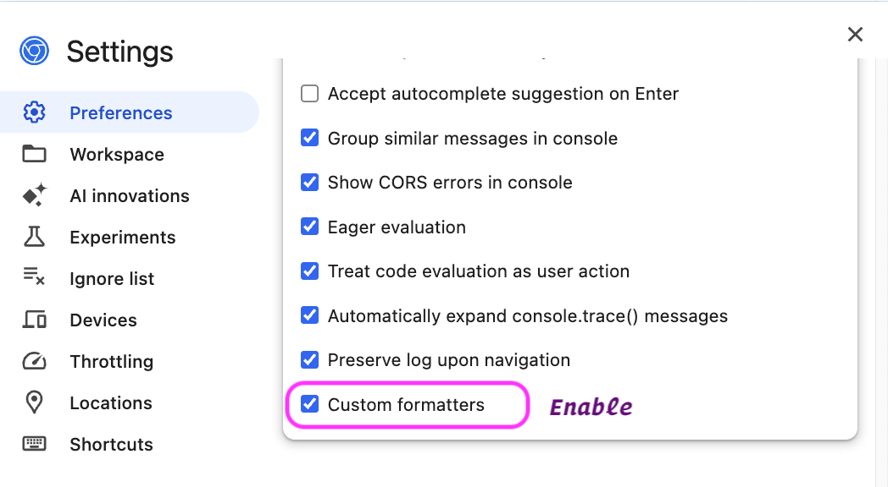

Los objetos aparecen en muchos lugares en las **Developer Tools**. Más comúnmente en la herramienta **Console**, pero también aparecen cuando estás en modo detective dentro de **Sources** (o Debugger) cuando depuras código JavaScript.

Las DevTools de cada navegador son las que deciden cómo aparecen estos objetos en la interfaz de usuario. Por ejemplo, las cadenas de texto y los números tienen diferentes colores, los arrays tienen una pequeña vista previa de los elementos y un icono que te permite expandirlos para ver la lista completa de elementos, etc.

Veamos algunos ejemplos de cómo se ven diferentes tipos de datos en la consola:


Pero... ¿y si tú quieres algo más? Algo que diga: "_este objeto es especial_"

Bienvenido a los `Custom Object Formatters`, una función no tan conocida que te deja customizar cómo se muestran tus objetos en las DevTools. Puedes hacer que tus objetos aparezcan con estilos personalizados, colores, e incluso con emojis.

Para poder hacer esto, primero necesitas activar el soporte para esta característica en el navegador.



## ¿Cómo se hace la magia?

Los `Custom Object Formatters` no es algo que configures en las DevTools. DevTools no tiene un panel de "personalización de objetos". En lugar de eso, tú defines el formato en el código de tu página, y DevTools lo detecta automáticamente.

### El formato base tiene tres propiedades

```javascript
{
  header: function(obj)   { /* Vista previa del objeto        */ },
  hasBody: function(obj)  { /* ¿Tiene más info para expandir? */ },
  body: function(obj)     { /* Lo que se ve al expandirlo     */ }
}
```

Todo esto se basa en `JsonML` (una forma muy extraña de escribir HTML en arrays). [Link](http://www.jsonml.org/).

### ¿Qué hace cada una?

- `header`: Devuelve una vista previa del objeto, en formato `JsonML`.
- `hasBody`: Devuelve un booleano que indica a DevTools si el objeto se puede expandir para mostrar más información.
- `body`: Devuelve la vista previa del objeto cuando está expandido, también en formato `JsonML`.

## Ejemplo práctico

Digamos que tienes una clase `UserBadge` que representa a un usuario con su nombre y nivel:

```javascript
class UserBadge {
  constructor(name, level) {
    this.name = name;
    this.level = level;
  }
}
```

Ahora quieres que al hacer `console.log(miUsuario)` en las DevTools, no salga esa cosa gris deprimente, sino algo que tenga estilo. Entonces haces tu custom formatter:

```javascript
const userBadgeFormatter = {
  header: function (object) {
    if (!(object instanceof UserBadge)) return null;

    return [
      "div",
      {
        style: `
          background-color: #f0f0f0;
          color: #333;
          border-left: 4px solid ${
            object.level === "Admin" ? "#e11d48" : "#3b82f6"
          };
          padding: 0.25rem 0.5rem;
          font-weight: bold;
          font-family: sans-serif;
        `,
      },
      `👤 ${object.name} (${object.level})`,
    ];
  },

  hasBody: function (object) {
    return object instanceof UserBadge;
  },

  body: function (object) {
    return [
      "ul",
      ["li", `Nombre: ${object.name}`],
      ["li", `Nivel: ${object.level}`],
      [
        "li",
        [
          "span",
          { style: "opacity: 0.7; font-size: 0.9rem;" },
          "Mostrado con estilo cortesía de DevTools + Custom Formatter ✨",
        ],
      ],
    ];
  },
};
```

Añade tu objeto formateador al array global `window.devtoolsFormatters`:

```javascript
// Puedes crear un nuevo array
window.devtoolsFormatters = [myCoolFormatter];

// O añadir a la lista de formateadores existentes
window.devtoolsFormatters.push(myCoolFormatter);
```

Eso es todo, no necesitas hacer nada más. Ahora, cada vez que los objetos `UserBadge` se muestren en las DevTools (por ejemplo, cuando uses `console.log(object)`), se mostrarán usando el formateador personalizado que has definido.

## Resultado

En esta imagen puedes ver el resultado de usar el formateador personalizado, primero sin expandir el objeto y luego expandido:


