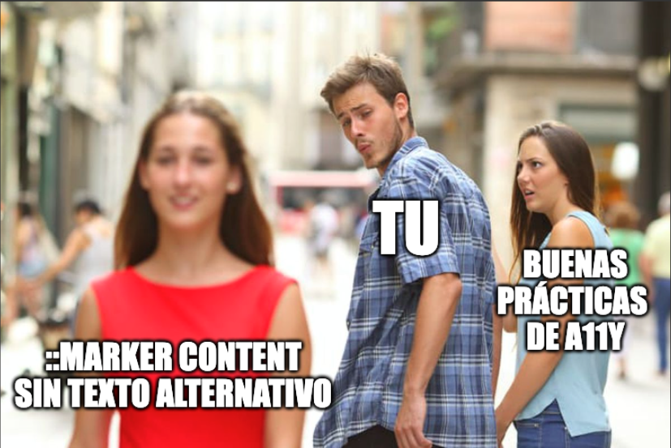

Añadir un emoji o un icono a una lista puede parecer una mejora visual menor, hasta que se prueba con un lector de pantalla. ¿Sabías que el contenido definido en `::marker` también se lee en voz alta?

Un elemento decorativo puede convertirse en ruido para personas que navegan con tecnologías de asistencia.

Ejemplo básico:

```css
summary::marker {
  content: "🎵";
}
```

```html
<summary>Playlist</summary>
```

Visualmente, el resultado puede parecer correcto. Sin embargo, un lector de pantalla podría anunciar "_Nota musical Playlist_", algo que no siempre coincide con la intención del contenido.

Por suerte, CSS permite separar el contenido visual del texto que se expone a tecnologías de asistencia mediante un segundo valor en `content`.

## Opción 1: Definir el texto anunciado

```css
summary::marker {
  content: "🎵" / "Música";
}
```

Con esta configuración, el lector anunciará "_Música Playlist_" en lugar de intentar interpretar el emoji.

## Opción 2: Omitir el anuncio del marcador

```css
summary::marker {
  content: "🎵" / "";
}
```

En este caso, el lector de pantalla anunciará únicamente "_Playlist_", ignorando el emoji. El cambio visual es nulo y la experiencia auditiva resulta más limpia.

> Nota: el comportamiento puede variar según la combinación de navegador y lector de pantalla, así que conviene validar en tu entorno objetivo. Así que haz pruebas cross-browser y con diferentes tecnologías de asistencia para asegurarte de que la experiencia es óptima para todos los usuarios.

---



Si usas macOS, puedes validarlo rápidamente con **VoiceOver**.
