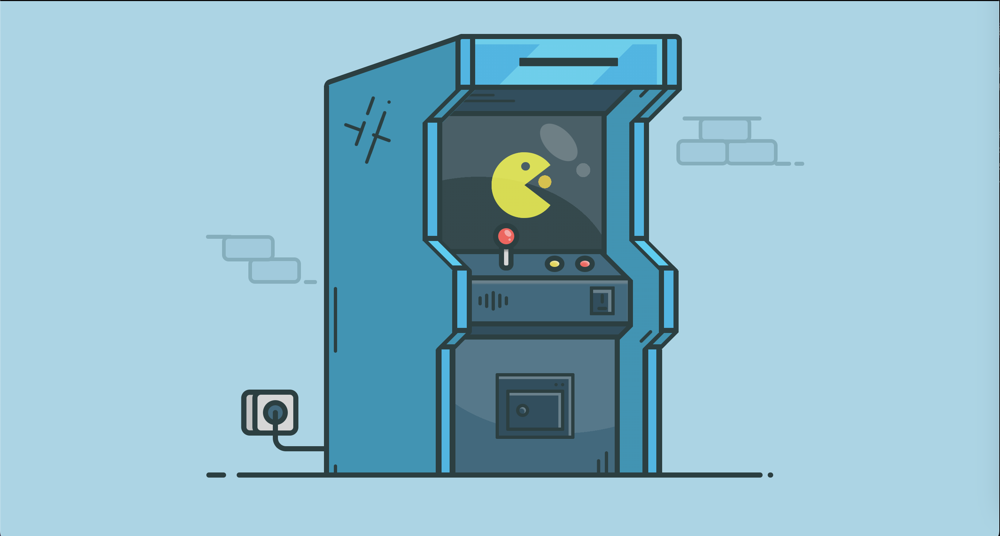
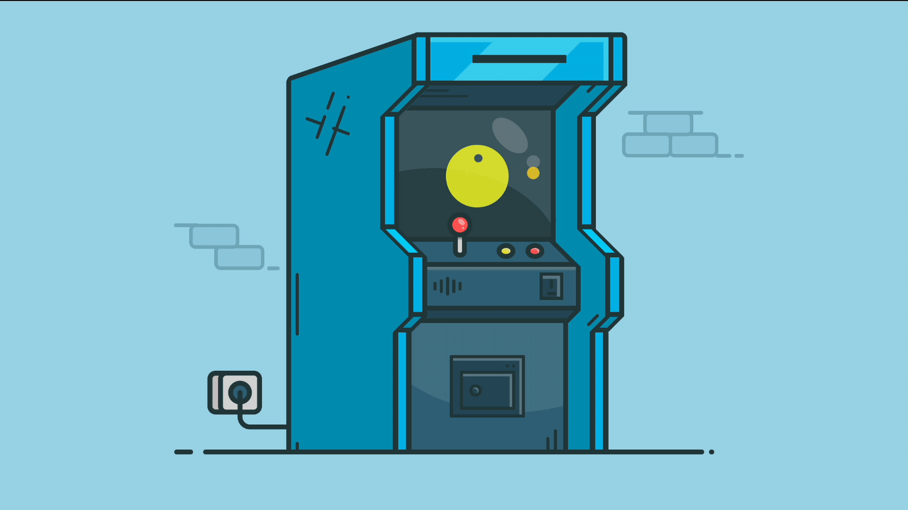

Tengo algo especial para compartir contigo. Por un momento, deja a un lado las herramientas gráficas y las técnicas de dibujo modernas. Acompáñame, vamos a retroceder en el tiempo y dar un paseo por los pasillos de las salas de juegos de los años 80. ¿Lo mejor? Todo esto es posible gracias a nuestro querido y versátil lenguaje: **CSS**. ✨

En esta aventura, he creado nada más y nada menos que una máquina de arcade, completamente elaborada con CSS. Cada pixel, cada matiz de color y cada minúscula animación se ha construido desde cero usando solo CSS. Creéme, no hay imágenes ni SVGs. ¡Solo CSS! 🤯

No te voy a engañar, este proyecto no fue una tarea sencilla, estuvimos unas ~25 h. en directo en Twitch. Requiere un conocimiento profundo de CSS, un poco de paciencia y una cantidad significativa de tiempo y esfuerzo. A pesar de todo esto, si te atreves a intentarlo, te aseguro que aprenderás mucho y te divertirás aún más.

Si lo haces en comunidad, como hicimos nosotros, la experiencia es mucho más enriquecedora. Puedes compartir tus ideas, resolver problemas juntos y, lo más importante, disfrutar del proceso.

Aunque el camino no fue fácil, el resultado final fue muy satisfactorio. ¡Mira cómo se ve la máquina arcade en acción!

## Enlaces de interés
- Código fuente en Codepen de la [máquina arcade CSS](https://codepen.io/baumannzone/pen/OJWddaa)
- Publicación en Instagram: https://www.instagram.com/p/CQ9Z3Y7o9Zo/
- Ilustración original en Dribbble: https://dribbble.com/shots/3394419-Pacman/

## ¿Por qué haces dibujos con CSS?
Si quieres saber por qué hago dibujos con CSS, te lo explico en este [artículo](../../assets/blog/dibujar-con-css/).

--- 

¿Tú también disfrutas dibujando con CSS? ¿Has intentado hacer algo similar? ¡Cuéntame en los comentarios!

¡Happy gaming! 🎮
