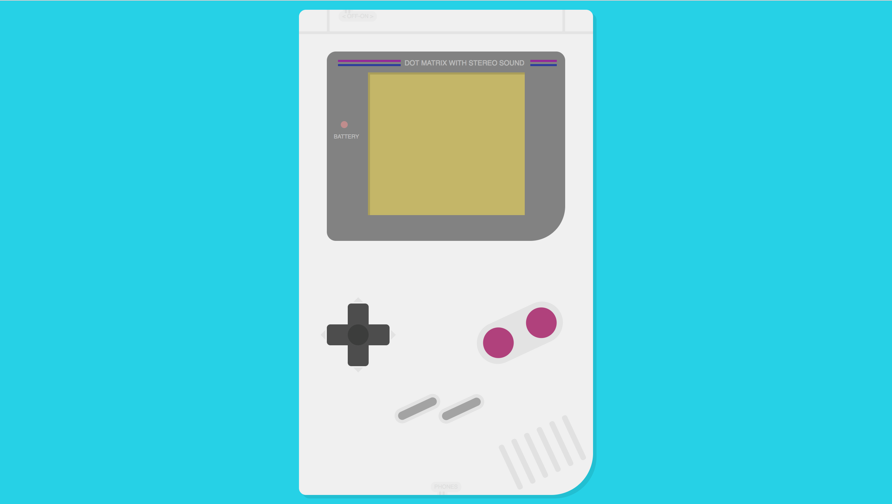
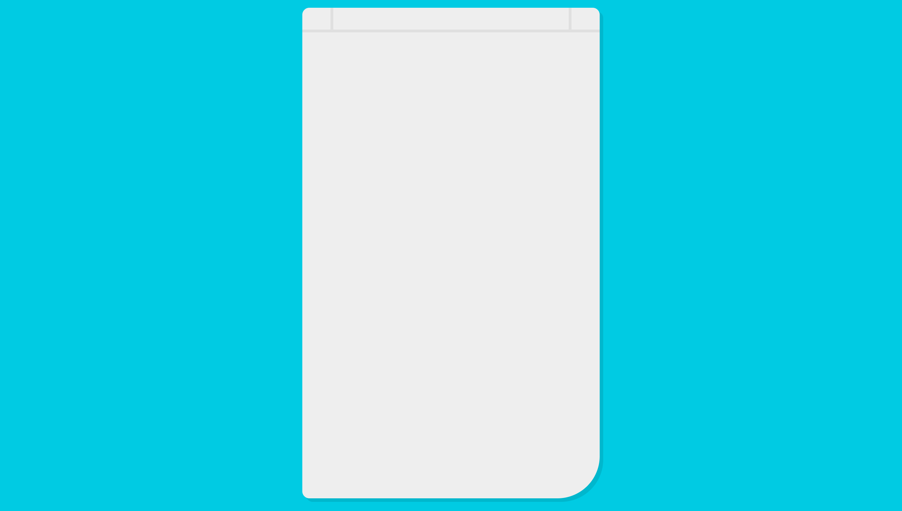
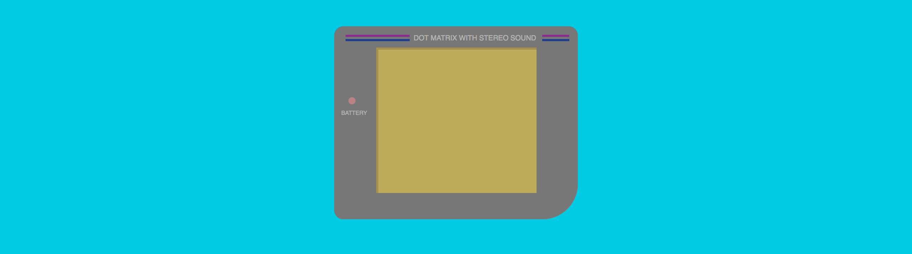
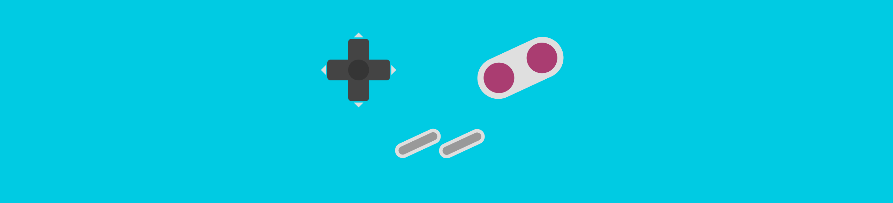
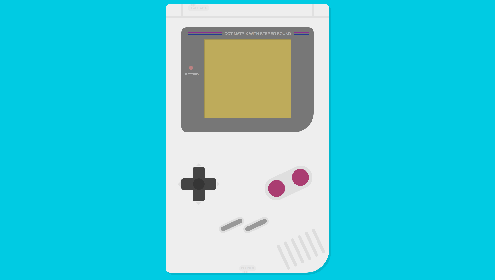
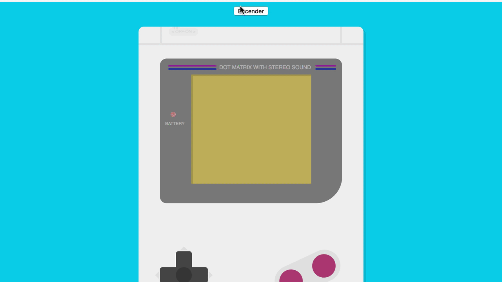

En esta publicación vamos a dibujar con CSS, la mítica Game Boy Original que tan buenos recuerdos nos trae a algunos, ¡mi primera consola!
Utilizaremos solo **CSS** y **HTML** (sin hacer uso de imágenes) para dibujar la consola.

## Live Demo

[https://baumannzone.github.io/gameboy-css/](https://baumannzone.github.io/gameboy-css/)



Empezaremos con la estructura del documento HTML. En este caso estoy usando _Pug_ (antiguamente conocido llamado _Jade_) como preprocesador HTML y _Stylus_ para el CSS.
Si no conoces [Pug](https://github.com/pugjs/pug) o [Stylus](http://stylus-lang.com/) te recomiendo que vayas a su página web y empieces a usarlos ya mismo.

**Actualización**: _A día de hoy (2024) ya no recomendaría usar Stylus, ya que CSS ha evolucionado mucho y tiene muchas de las características que Stylus ofrecía._

Hemos dividido el código por bloques de elementos, como pueden ser la carcasa, la pantalla, los botones, etc.

Para crear la Game Boy Original solo con HTML y CSS vamos a hacer uso, entre otros, de los pseudo-elementos `:before` y `:after` y también aprovecharemos la propiedad `box-shadow` para duplicar contenido similar.

## Estructura HTML

Esta es la estructura HTML de nuestra futura Game Boy. Recuerda que estamos usando Pug en vez de HTML:

```pug
<!-- index.pug -->

.gameboy
  .screen-cont
    .power
    .screen
      .header DOT MATRIX WITH STEREO SOUND
      .animated-text Nintendo
        .copy ®
    .controls-cont
      .btn-direction
        .vertical
        .horizontal
      .btn-AB
      .btn-start-select
    .speakers
```

## CSS (con Stylus)

### Carcasa

En primer lugar creamos la carcasa que va a contener todos los elementos.

La clase `.gameboy`, que es la clase que engloba todos los demás elementos, corresponde a la carcasa de nuestra Game Boy. Con `:before` y `:after` creamos las líneas superiores.

```stylus
// main.styl
.gameboy
  position relative
  display block
  margin 20px auto
  width 422px
  height 697px
  background #EEE
  border-radius 10px 10px 60px 10px
  box-shadow 5px 5px rgba(0, 0, 0, 0.1)

  &:before
    content ""
    position absolute
    width 100%
    height 31px
    border-bottom 4px solid #E0E0E0

  &:after
    content ""
    position absolute
    top 0
    width 334px
    height 31px
    border-left 4px solid #E0E0E0
    border-right 4px solid #E0E0E0
    margin-left 40px
    margin-right 40px
```



### Pantalla

A continuación, vamos a crear la pantalla. Tenemos varias capas que en conjunto forman la pantalla, están bajo la clase `.screen-cont`, que es una capa de color gris oscuro, cuyas esquinas están redondeadas. Esta es la capa base, sobre la cual pintamos la pantalla del color amarillo verdoso, característico en estas videoconsolas.  
Agregamos otra capa `.power` que simulará el led indicador de encendido y de batería 🔋.  
Con la capa `.header` y el texto escrito en HTML, conseguimos la parte superior de la pantalla. Las líneas paralelas a ambos lados del texto las generamos con los pseudo-elementos `before` y `after` (uno para cada lado) y combinando una capa de un determinado tamaño con el fondo de color azul de la cual proyectamos una sombra de color morado, dando el efecto de 2 líneas. El código es el siguiente:

```stylus
// main.styl

.screen-cont
  position relative
  top 60px
  left 40px
  width 342
  height 272
  margin-bottom 58px
  background-color #777
  border-radius 13px 13px 50px 13px

  .screen
    position relative
    top 30px
    margin-left auto
    margin-right auto
    background #bdae58
    width 225px
    height 205px
    box-shadow inset 3px 3px rgba(0, 0, 0, 0.15)

    // Text and lines
    .header
      position relative
      top -30px
      width 100%
      height 30px
      padding-top 10px
      box-sizing border-box
      text-align right
      font-size 10px
      font-family sans-serif
      color #b3b3b3

      // Lines
      &:before
        content ""
        position absolute
        left -43px
        top 12px
        width 90px
        height 3px
        background-color #8b1d90
        box-shadow 0 6px 0 #283593

      &:after
        content ""
        position absolute
        right -46px
        top 12px
        width 38px
        height 3px
        background-color #8b1d90
        box-shadow 0 6px 0 #283593
```

### Led de encendido 🚨

Tenemos la capa principal `.power` que simula el led cuando está apagado. Haciendo uso de la propiedad `content` en el elemento `:before` correspondiente a la clase del led, le metemos el texto y lo posicionamos.

La clase `.power-on` es una clase que le vamos a agregar al elemento del led y que va a simular que se enciende, poniendo un rojo más intenso de color de fondo, y dándole un poco de resplandor de color rojizo también con `box-shadow`.

```stylus
// main.styl

.power
  content ""
  position absolute
  width 10px
  height 10px
  top 100px
  left 20px
  border-radius 100%
  background-color #b98181
  transition background-color 300ms linear

  // Battery Text
  &:before
    content "BATTERY"
    position relative
    top 18px
    left -10px
    font-size 8px
    font-family sans-serif
    color #b3b3b3

  // Led Effect
  &.power-on
    background-color red
    box-shadow: 0 0 3px 1px #EF5350;
```

Si has visto la demo, habrás visto que hay un texto animado junto con otros efectos como la luz de la batería o el botón de apagar.



### Texto Nintendo

Vamos a crear una capa que va a contener el texto que más adelante animaremos. La fuente más similar a la tipografía de Nintendo que existe se llama **Pretendo** y la puedes descargar desde [aquí](http://www.abstractfonts.com/font/11800).

Vamos a crear el CSS necesario con Stylus:

```stylus
// main.styl

.animated-text
  opacity 0
  display inline
  position relative
  top -26px
  left 30%
  color #8a891f
  font-size 17px
  font-family "Pretendo"
  z-index 10

  // Animation effect
  &.end
    opacity 1
    top 50px
    transition top 3s linear

  .copy
    position relative
    display inline
    top -2px
    margin-left 2px
    font-size 15px
    font-family monospace
```

El texto de Nintendo (por defecto está oculto), lo animaremos agregándole la clase `.end`. Esto simplemente hará visible el texto y lo animará desde la parte superior de la pantalla hasta la parte central, durante 3 segundos.  
La fuente de _Pretendo_ no tiene el carácter de copyright (©), por lo que tenemos que sacarlo de otra fuente.

## Botones

Tenemos tres grupos de botones, todos ellos agrupados en una capa maestra llamada `.controls-cont`.

```stylus
// main.styl

.controls-cont
  display block
  position relative
  margin-top 90px
```

### Botones de movimiento

Arriba, abajo, izquierda y derecha. Esta capa `.btn-direction` tiene a su vez dos capas más, una para los botones de arriba y abajo, y otra para los botones de izquierda y derecha, `.vertical` y `.horizontal` respectivamente.
El botón con forma de cruz, tiene en el centro un círculo ligeramente visible, que se obtiene con el `:before` de la capa `.btn-direction`.

La capa horizontal es una copia exacta de la capa vertical, la única diferencia es que la hemos girado 90 grados ⤵️ sobre su centro consiguiendo así formar una cruz que da lugar al botón de movimiento.  
En cada extremo hay unos pequeños triángulos que indican dirección. Dichos triángulos los hemos conseguido utilizando bordes en elementos de cero `px` de tamaño dentro de los pseudo-elementos `:before` y `:after`.

Se entiende mejor si ves el código utilizado:

```stylus
// main.styl

// Pad
.btn-direction
  position relative
  margin-left 40px
  top 60px

  &:before
    content ""
    position absolute
    z-index 1
    top 30px
    left 30px
    width 30px
    height 30px
    background-color #353535
    border-radius 100%

  .vertical,
  .horizontal
    position absolute
    left 30px
    width 30px
    height 90px
    background #444
    border-radius 5px

    &:before
      content ""
      position relative
      top 99px
      left 8px
      width 0
      height 0
      border-left 7px solid transparent
      border-right 7px solid transparent
      border-top 7px solid #dedede

    &:after
      content ""
      position relative
      top -27px
      left -5.6px
      width 0
      height 0
      border-left 7px solid transparent
      border-right 7px solid transparent
      border-bottom 7px solid #dedede

  // Rotate 90º
  .horizontal
    rotation 90deg
```

### Botones A y B

Primero creamos una capa (`.btnAB`) que solo va a tener un color de fondo gris y una forma alargada con las esquinas redondeadas.  
Dentro del `:after` de dicha capa creamos un círculo de un color granate y una sombra de dicho círculo del mismo color, _duplicando_ así el contenido de manera sencilla.  
En ambos casos, le damos la inclinación adecuada con `transform rotate`.

```stylus
// main.styl

// Background
.btn-AB
  position absolute
  top 72px
  left 252px
  width 130px
  height 60px
  background #DFDFDF
  border-radius 30px
  -webkit-transform rotate(-25deg)

  // A/B Buttons
  &:after
    content ""
    position absolute
    top 8px
    right 9px
    width 44px
    height 44px
    background #A93671
    box-shadow 68px 0 #A93671
    border-radius 100%
    -webkit-transform rotate(180deg)
```

### Botones Start y Select

Los botones de _start_ y _select_, son los más sencillos de conseguir, solo constan de una capa de color gris con una sombra del mismo color para duplicar dicho botón y así obtener los dos. Luego le damos la inclinación deseada ¡y listo!  
Le damos un efecto de borde a estos botones con `box-shadow`, fíjate que tenemos el duplicado del botón y dos sombras más que simulan el borde.

```stylus
// main.styl

// Start Select buttons
.btn-start-select
  position absolute
  top 205px
  left 140px
  height 12px
  width 60px
  background #999
  border-radius 10px
  -webkit-transform rotate(-25deg)
  box-shadow 57px 27px #999, 0 0 0 5px #dfdfdf, 57px 27px 0 5px #dfdfdf
```



## Sonido

Las ranuras para la salida del sonido, que corresponden a la capa `.speakers`, también son bastante sencillas de hacer con CSS, muy parecidas a los botones anteriores. Vamos a crear un elemento y lo duplicaremos con repeticiones de sombras usando `box-shadow`.

```stylus
// main.styl

.speakers
  content ""
  position relative
  height 70px
  width 8px
  top 260px
  left 300px
  background #DDD
  border-radius 4px
  -webkit-transform rotate(-25deg)
  box-shadow 20px 0 #ddd, 40px 0 #ddd, 60px 0 #ddd, 80px 0 #ddd, 100px 0 #ddd
```

## Indicadores

### Auriculares

Por último tenemos `.phones`, que es donde se supone que podemos enchufar los auriculares y tiene un pequeño relieve que conseguimos con una capa de tamaño pequeño y la duplicamos con una sombra.

```stylus
// main.styl

.phones
  position: absolute;
  bottom: 4px;
  left: 50%;
  padding 3px 5px
  transform: translateX(-50%);
  color: #dadada;
  background-color #e8e8e8
  font-size: 8px;
  font-family: sans-serif;
  text-transform: uppercase;
  border-radius: 30px;

  &:before
    content ""
    position absolute
    width 15px
    height 5px
    bottom -4px
    background-color: #e8e8e8
    left 9px

  &:after
    content ""
    position absolute
    width 3px
    height 5px
    bottom -4px
    left 12px
    background-color: #ddd
    box-shadow 5px 0 #ddd
    border-radius 4px 4px 0 0
```

### Encendido / Apagado

Lo mismo para el indicador de _on/off_, pero en la parte superior izquierda y con algún que otro cambio en cuanto a posiciones:

```stylus
// main.styl

.on-off
  position: absolute;
  top: 2px;
  left: 20%;
  padding 3px 5px
  transform: translateX(-50%);
  color: #dadada;
  background-color #e8e8e8
  font-size: 8px;
  font-family: sans-serif;
  text-transform: uppercase;
  border-radius: 30px;

&:before
    content ""
    position absolute
    width 15px
    height 5px
    top -2px
    background-color: #e8e8e8
    left 6px

&:after
    content ""
    position absolute
    width 3px
    height 5px
    top -2px
    left 9px
    background-color: #ddd
    box-shadow 5px 0 #ddd
    border-radius 0 0 3px 3px
```

Este es el resultado de juntarlo todo:



Pero aún no hemos terminado, ¡llega el momento más divertido! Es hora de darle vida a este proyecto de CSS haciendo uso de JavaScript.

## JavaScript

¿Recuerdas las clases de CSS `.end` y `.power-on`? ¡Ahora es el momento de usarlas!

Vamos a hacer uso de JavaScript — _Make JavaScript great again_ — para simular la animación que hacía la Game Boy cuando la encendías. Compruébalo ahora mismo [aquí](https://baumannzone.github.io/gameboy-css/).



Vamos a incluir dos botones, uno de encendido y otro de apagado, al inicio de nuestro documento HTML. El de apagado por defecto va a estar oculto.

```pug
<!-- index.pug -->

input.btn-on(type="button", value="Encender")
input.btn-off.btn-hide(type="button", value="Apagar")
```

Además, para que sea mucho más molón, vamos a incluir un archivo de audio en el HTML, con la etiqueta `<audio>` de HTML5.

```pug
<!-- index.pug -->

audio(src="sound/gameboy-sound.mp3")
```

Dos botones, el de encendido y el de apagado. Este último con la clase `.btn-hide`, para que el botón no se muestre mientras tenga esa clase. El código CSS es el siguiente:

```stylus
// main.styl

input
  &.btn-on,
  &.btn-off
    display block
    margin 0 auto;
    font-family: sans-serif;
    text-align center

  &.btn-hide
    display none
```

Ya tenemos todos los elementos (botones, clases y elemento de audio) listos para ser usados. Ahora sí, es el turno de JavaScript:

```js
// main.js

const audio = document.querySelector(`audio`);
const btnON = document.querySelector(`.btn-on`);
const btnOFF = document.querySelector(`.btn-off`);
const power = document.querySelector(`.power`);
const text = document.querySelector(`.animated-text`);
```

### Encender

Lo que vamos a hacer es ocultar el botón de encendido (`.btn-on`) y mostrar el botón de apagado (`.btn-off`) cuando se haga click en el botón de encender.

También tenemos que encender el led de la batería, cosa que conseguimos agregando al elemento power la clase `.power-on`.  
Por último, hay que agregarle la clase `.end` a la capa que tiene el texto de **Nintendo** y esperar a que termine la animación y hacer sonar el elemento de audio.

Por lo tanto, en el `onclick` del botón de encender tendríamos algo parecido a esto:

```js
// Turn on
btnON.onclick = function () {
  // Button
  btnON.classList.add("btn-hide");
  btnOFF.classList.remove("btn-hide");

  // Power Led
  power.classList.add("power-on");

  // Animate text & play sound
  const transitionEvent = whichTransitionEvent();
  text.classList.add("end");
  text.addEventListener(transitionEvent, playSound);
};
```

`wichTransitionEvent` y `playSound` son funciones que hemos creado previamente:

```js
// main.js

function whichTransitionEvent() {
  let t;
  const el = document.createElement("fake");
  const transitions = {
    transition: "transitionend",
    OTransition: "oTransitionEnd",
    MozTransition: "transitionend",
    WebkitTransition: "webkitTransitionEnd",
  };

  for (t in transitions) {
    if (el.style[t] !== undefined) {
      return transitions[t];
    }
  }
}

// Play Sound
function playSound() {
  audio.currentTime = 0;
  audio.play();
}
```

- `whichTransitionEvent` es para determinar el nombre del _listener_, ya que depende del navegador, pues cada uno tiene uno distinto.

- La función de `playSound` es muy fácil. Lo único que hace es coger el elemento de audio que creamos antes, y hacerlo sonar.
  Para una mejor experiencia, reseteamos el "cursor" del elemento de audio a cero antes de hacerlo sonar, con la propiedad `currentTime`. De este modo, si el audio está sonando y vuelves a invocar a la función de `playSound` el audio va a sonar inmediatamente desde el principio, sin tener que esperar que termine el audio invocado anteriormente.

### Apagar

Ahora hay que deshacer estos cambios cuando pulsemos el botón de apagar.

- Mostrar el botón de encender, quitándole la clase `.btn-hide`.
- Ocultar el botón de apagar, agregándole la clase `.btn-hide`.
- Apagar el led, quitándole la clase `.power-on`.
- Ocultar el texto de Nintendo, quitando la clase `.end`.

```js
// main.js

btnOFF.onclick = function () {
  // Button
  btnON.classList.remove("btn-hide");
  btnOFF.classList.add("btn-hide");

  // Power Led
  power.classList.remove("power-on");

  // Text
  text.classList.remove("end");
};
```

## Video: Dibujando la Game Boy con HTML y CSS

<iframe width="100%" height="350px" src="https://www.youtube.com/embed/Drj78FhXz5U" frameborder="0" allowfullscreen></iframe>

## Código

Puedes ver el código completo en este repositorio de GitHub: [https://github.com/baumannzone/gameboy-css](https://github.com/baumannzone/gameboy-css).

¡Esto es todo, developers! Hay muchas formas de dibujar una Game Boy con CSS, en esta ocasión hemos optado por hacerlo así, pero no es la única.

¿Cuál es la tuya? ¿Has hecho alguna vez algo parecido? ¡Cuéntamelo en los comentarios!

¡Happy coding! 🚀
