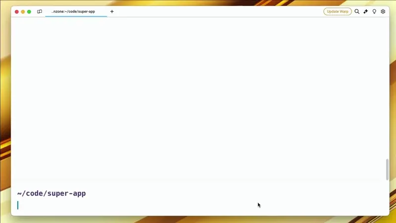
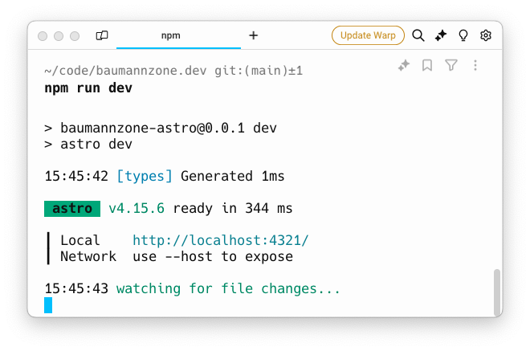

En el ecosistema de JavaScript y Node.js, el archivo `package.json` juega un papel fundamental.

Piensa en `package.json` como el corazón de tu proyecto. Es donde guardas toda la info importante: qué hace tu proyecto, qué versión es, qué librerías necesita para funcionar... básicamente, es el manual de instrucciones de tu aplicación.

## Inicializar un proyecto

¿Recuerdas la primera vez que escribiste "_Hola Mundo_" en programación? Bueno, crear tu primer `package.json` es casi igual de aburrido. Solo tienes que abrir tu terminal y escribir:

```bash
npm init
```



`npm` te hará un montón de preguntas, como si estuvieras en una cita rápida con tu proyecto. Si no sabes qué responder, puedes usar el flag `-y` para que `npm` rellene automáticamente todas las respuestas por ti:

```bash
npm init -y
```

_¡Boom!_ Tienes un `package.json` instantáneo con los valores predeterminados.

## Partes de un `package.json`

Ahora, echemos un vistazo a las partes más interesantes de un `package.json`:

- `name` y `version`: Es como el nombre y apellido de tu proyecto.

```json
{
  "name": "mi-super-app",
  "version": "1.0.0"
}
```

El nombre de tu proyecto debe ser único, ya que (si lo publicas) se usa para identificar tu proyecto en el registro de paquetes de npm. 

La versión sigue el formato de _SemVer_ (Semantic Versioning), que consta de tres números: `MAJOR.MINOR.PATCH`.

- `scripts`: Aquí es donde la magia sucede. Puedes crear atajos para comandos que usas frecuentemente.

```json
{
  // ...
  "scripts": {
    "dev": "astro dev",
    "start": "astro dev",
    "build": "astro build",
  }
}
```

Este es un ejemplo del bloque `scripts` de un `package.json` de un proyecto Astro.

Para ejecutar un script, solo tienes que escribir `npm run` seguido del nombre del script:

```bash
npm run dev
```



- `dependencies` y `devDependencies`: Aquí es donde guardas las librerías que necesita tu proyecto para funcionar. La diferencia entre ambas es que `dependencies` son las librerías que necesita tu proyecto en producción, mientras que `devDependencies` son las librerías que solo necesitas en desarrollo.

```json
{
  // ...
  "dependencies": {
    "express": "^5.0.0",
    "react": "^18.3.1"
  },
  "devDependencies": {
    "vitest": "^2.1.1",
  }
}
```

Las versiones de las librerías siguen el formato de _SemVer_, pero puedes usar caracteres especiales como `^`, `~` o `*` para especificar rangos de versiones.

- `keywords`: Aquí puedes añadir palabras clave que describan tu proyecto. Esto es útil para que otros desarrolladores puedan encontrar tu proyecto más fácilmente. Si no vas a publicar tu proyecto en npm, puedes ignorar esta propiedad.

```json
{
  "keywords": ["metaverse", "css-in-js", "3d"]
}
```

- `license`: Aquí puedes especificar bajo qué licencia se distribuye tu proyecto. Si no estás seguro de qué licencia usar, puedes elegir una de las licencias más populares, como MIT.

```json
{
  "license": "MIT"
}
```

Si quieres saber más sobre las licencias de software, puedes leer <a href="https://choosealicense.com/" target="_blank" rel="noopener noreferrer">este artículo</a>.


- `repository`: Aquí puedes especificar la URL de tu repositorio de código. No es obligatorio, pero es útil si quieres que otros desarrolladores puedan encontrar tu código fuente.

```json
{
  "repository": {
    "type": "git",
    "url": "https://github.com/baumannzone/mi-super-app"
  }
}
```

Existen muchas más propiedades (como `homepage`, `engines`, `peerDependencies`, etc.) que puedes añadir a tu `package.json`, pero estas son las más comunes y las que deberías conocer para empezar.

## El drama de los gestores de paquetes

Ahora, hablemos de algo un poco más controversial: los gestores de paquetes. Es como la guerra de las consolas, pero para developers.

### npm
npm (_node package manager_) es el gestor de paquetes por defecto en Node.js, y aunque otros han surgido, sigue siendo el más utilizado en la comunidad. Tiene sus defectos, pero lo conoces bien y sabes cómo funciona.

### Yarn
Yarn fue desarrollado por Facebook como una alternativa a npm, con el objetivo de resolver problemas de consistencia, seguridad y rendimiento. Fue muy popular en su lanzamiento, pero ha perdido algo de tracción en los últimos años.

### pnpm
`pnpm` (_performant npm_) es otra alternativa que se centra en la eficiencia del almacenamiento y la velocidad de instalación. En lugar de instalar paquetes en carpetas separadas, pnpm crea enlaces simbólicos a los paquetes compartidos. Es lo que podrías llamar "el chico nuevo del barrio".

### bun
Bun es una herramienta todo en uno que incluye un runtime de JavaScript, un bundler, un test runner y un gestor de paquetes. Lanzado más recientemente que Yarn y pnpm, Bun se ha ganado rápidamente popularidad debido a su enfoque en el rendimiento y por su velocidad. Si lo usas a día de hoy en producción, es porque eres un hipster profesional.

## ¿Cuál elegir?
Depende. Por lo general, cualquiera de estas herramientas hará el trabajo que necesitas. **npm** es el más común, **Yarn** vino con fuerza pero ahora nadie lo usa, **pnpm** es el que uso actualmente, y **Bun** acaba de salir y parece prometedor.

¿Mi consejo? **pruébalos todos**. Usa el que te resulte más cómodo y que mejor se adapte a tu flujo de trabajo. No hay una respuesta correcta, solo la que funcione mejor para ti.

Lo importante es que, sin importar qué herramienta uses, `package.json` sigue siendo el jefe.

## Conclusión

`package.json` es un archivo esencial en casi cualquier proyecto de JavaScript. Asegúrate de entender cómo funciona y qué propiedades puedes añadir para mejorar la calidad de tu proyecto.