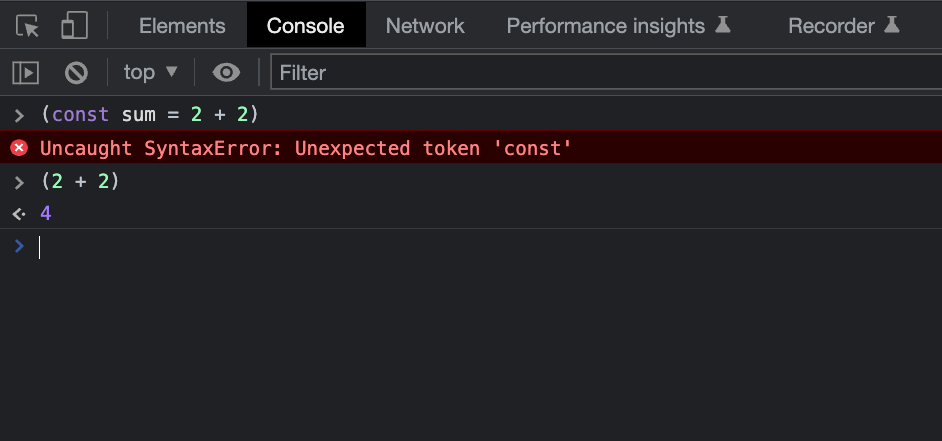

Cuando estás desarrollando con JavaScript, existe la posibilidad de que haya una función o variable con el mismo nombre en otros archivos JavaScript escritos por otros desarrolladores o en librerías de terceros. Si incluyes estos archivos en una sola página web, puede ser que se contamine el _scope global_ teniendo varias funciones o variables con el mismo nombre.

Tomemos como ejemplo dos archivos JavaScript que contienen una función con el mismo nombre:

```js
// file-1.js
const name = "Baumann";
function sayHello() {
  console.log(`Hello, ${name}!`);
}
sayHello();
```

```js
// file-2.js
const name = "Rambito.js 🐶";
function sayHello() {
  console.log(`Hello, ${name}!`);
}
sayHello();
```

¿Qué pasa si incluimos ambos archivos en una sola página web?

```html
<!-- index.html -->
<!DOCTYPE html>
<html lang="es">
  <head>
    <meta charset="UTF-8" />
    <title>IIFE - Baumannzone.dev</title>
  </head>
  <body>
    <script src="file-1.js"></script>
    <script src="file-2.js"></script>
  </body>
</html>
```

Si ejecutas la función de `sayHello()` y abres la consola del navegador verás que el resultado es el siguiente:

```bash
> Hello, Rambito.js 🐶!
```

Esto sucede porque la última función que se ejecuta es la que está en el archivo `file-2.js`. Esto se debe a que la variable `name` y la función `sayHello` se sobreescriben en el ámbito global. Es decir, la última función `sayHello()` sobrescribirá la primera función `sayHello()` y sólo se ejecutará la función de `file-2.js`.

Las IIFE solucionan este problema ya que tienen su propio scope y evitan que las variables y funciones sean globales. En este artículo veremos cómo funcionan y cómo podemos usarlas.

## ¿Qué es una IIFE?

Una **IIFE** o **Immediately Invoked Function Expression** es una expresión de función que se ejecuta inmediatamente después de ser creada. Es un patrón de diseño muy utilizado en JavaScript. También se las conoce como _funciones autoejecutables_, _funciones autoinvocadas_ o _funciones anónimas autoejecutables_.

La principal característica de este patrón de diseño es que las funciones se llaman a sí mismas después de ser declaradas. Es decir, que se ejecutan de manera inmediata después de ser creadas.

```js
(function () {
  const name = "Baumann";
  console.log(`Hello, ${name}!`);
})();

// Llama a la función inmediatamente después de definirla
// con los paréntesis del final.
```

Cuando declaras una variable dentro de una función sólo podrás acceder a su valor dentro de esa función, independientemente de si la función es autoejecutable o no. Esto es una característica de JavaScript que se conoce como _scope_, alcance o ámbito.

## ¿Cómo se escribe una IIFE?

Los paréntesis `()` juegan un papel importante en el patrón IIFE. En JavaScript, los paréntesis no pueden contener declaraciones, solo pueden contener una expresiones.

```js
// Inválido
(const sum = 2 + 2)
(const name = 'rambito.js')

// Válido
(2 + 2)
(!false)
(alert('baumannzone.dev'))
```



Una IIFE se compone de dos partes:

1. Una expresión de función anónima con paréntesis alrededor de ella ([el operador de agrupación](https://developer.mozilla.org/en-US/docs/Web/JavaScript/Reference/Operators/Grouping)).
2. Los paréntesis alrededor de la expresión de función anónima para invocarla inmediatamente.

Para crear una IIFE, lo primero que vas a hacer es crear una expresión de función, como sueles hacerlo normalmente:

```js
const myFunction = function () {
  console.log("Hello, Developer! 👋");
};
```

Luego, envuelves la expresión de función en paréntesis. Los paréntesis no pueden contener declaraciones, solo expresiones. Por lo tanto, tienes que borrar la parte de la declaración:

```js
(function () {
  console.log("Hello, Developer! 👋");
});
```

Por último debes agregar el operador paréntesis `()` al final de la expresión de función:

```js
(function () {
  console.log("Hello, Developer! 👋");
})();
```

Ahora ya puedes escribir todas las funciones y variables dentro de una IIFE sin preocuparte por contaminar el ámbito global o entrar en conflicto con otro código de JavaScript que tenga funciones o variables con el mismo nombre.

Además se resuelve el problema que teníamos antes con los archivos `file-1.js` y `file-2.js`:

## Ventajas de usar IIFE en JavaScript

Estos son algunas de las ventajas y usos comunes que tienen las IIFE en JavaScript:

### Proteger el alcance de variables y funciones

Las IIFE se utilizan a menudo en JavaScript para crear un scope local y evitar contaminar el ámbito scope global, es decir, para crear un ámbito de ejecución aislado y evitar la contaminación del ámbito global. Al crear una IIFE y definir variables y funciones dentro de ella, esas variables y funciones solo estarán disponibles dentro de la función (como en cualquier otra función normal) y no se agregarán al scope global.

```js
(function () {
  const name = "Baumann";
  function sayHello() {
    console.log(`Hello, ${name}!`);
  }
  sayHello();
})();

sayHello(); // ✕ ReferenceError: sayHello is not defined
```

### Evitar conflictos de nombres

Evitar conflictos de nombres y mejorar la organización del código o para evitar que las variables se sobreescriban o se modifiquen por accidente. Sobre todo si tienes varias bibliotecas o fragmentos de código que usan el mismo nombre para sus variables o funciones.

```js
(function () {
  const name = "Baumann";
  function sayHello() {
    console.log(`Hello, ${name}!`);
  }
  sayHello();
})();

(function () {
  const name = "Rambito.js 🐶";
  function sayHello() {
    console.log(`Hello, ${name}!`);
  }
  sayHello();
})();

// Hello, Baumann!
// Hello, Rambito.js 🐶!
```

### Mejorar la organización del código.

Al agrupar código relacionado dentro de una IIFE, puedes mejorar la legibilidad y mantenibilidad de tu código.

¿Conoces alguna otra ventaja de usar IIFE en JavaScript? ¡Cuéntamelo en los comentarios! 👇

## ¿Cuándo no usar IIFE en JavaScript?

Las IIFE son útiles en diversos casos, pero hay algunas situaciones en las que es recomendable evitar su uso:

- **Cuando no se necesita aislar el ámbito de las variables**: Si la función no utiliza variables que puedan entrar en conflicto con otras del mismo nombre, o si no se requiere crear un ámbito privado para evitar el acceso a ciertas variables, entonces no tiene sentido utilizar una IIFE.

- **Cuando se necesita reutilizar la función**: Si la intención es utilizar la función en más de un lugar del código, es mejor definirla de manera explícita y luego invocarla cuando sea necesario, en lugar de utilizar una IIFE.

- **Cuando se necesita pasar parámetros a la función**: Aunque es posible pasar parámetros a una IIFE, es más sencillo hacerlo cuando la función está definida de manera explícita.

- **Cuando se quiere crear una función de manera más legible**: Aunque las IIFE son útiles para minimizar el código, pueden dificultar la lectura y entendimiento del mismo, especialmente cuando la función es larga o complicada. En estos casos, es mejor definir la función de manera explícita.

Es importante tener en cuenta que las IIFE son una herramienta más en el arsenal de un programador JavaScript, y deben utilizarse cuando se ajusten a las necesidades del código en cuestión.

## Curiosidades sobre las IIFE

Esta información es interesante para profundizar en el tema, pero no es necesaria para entender el concepto de IIFE en JavaScript.

Las IIFE soportan parámetros y retornos:

```js
(function (name) {
  console.log(`Hello, ${name}!`);
})("Baumann");

// Hello, Baumann!
```

```js
const result = (function (a, b) {
  return a + b;
})(1, 2);

console.log(result); // 3
```

### Formas alternativas de escribir una IIFE

Las IIFE también pueden ser escritas de la siguiente manera:

- Las más habituales:

```js
// Paréntesis internos (recomendada por Crockford)
(function () {
  console.log("Hello, Developer! 👋");
})();

// Arrow functions
(() => {
  console.log("Hello, Developer! 👋");
})();

// Operador negación
!(function () {
  console.log("Hello, Developer! 👋");
})();
```

- Si no te importa el valor de retorno

```js
~(function () {})(); // -1
+(function () {})(); // NaN
-(function () {})(); // NaN
```

- Otras formas menos habituales y más rebuscadas:

```js
// Operador void
void (function () {})();

// Operador new
new (function () {})();

true && (function () {})();
42, (function () {})();

// etc
```

Podríamos seguir con más formas de escribir una IIFE, pero con estas ya tienes suficiente para entender el concepto. Lo importante aquí es que entiendas cómo funciona JavaScript y la **coerción de tipos**.

La mayoría de formas alternativas no las vas a usar, ya que son formas de escribir código bastante confusas, pero usadas a menudo cuando haces **code golfing** o para minificar código.

## ¿Quieres seguir aprendiendo?

Ahora que sabes qué son las expresiones de función inmediatamente invocadas en JavaScript, es momento de seguir aprendiendo. Sígueme en [Instagram](https://www.instagram.com/baumannzone/) y comparte este artículo para que más personas puedan aprender JavaScript.

¿Conocías las IIFE? ¿Las has usado alguna vez? ¡Cuéntamelo en los comentarios! 👇

¡Happy coding!
