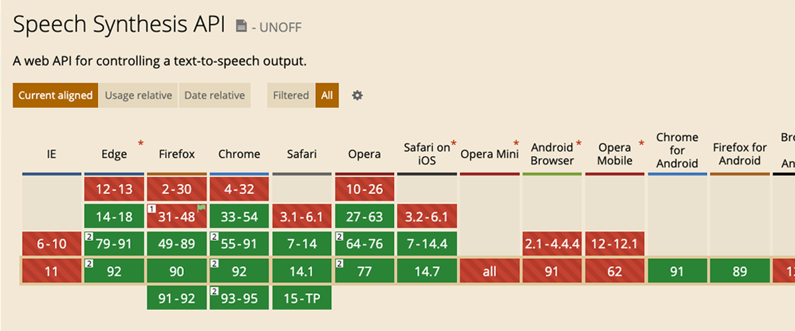
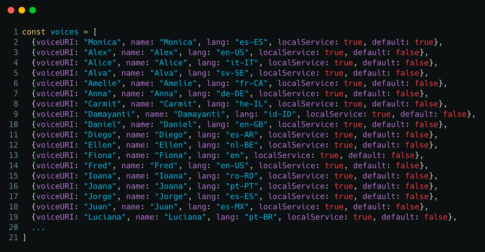

La **Web Speech API** (API de Voz) te permite incorporar datos de voz a tus aplicaciones web, directamente desde el navegador.
La Web Speech API tiene dos partes:

- **SpeechSynthesis**: texto a voz.
- **SpeechRecognition**: reconocimiento de voz.

En este artículo vamos a explorar la parte de **SpeechSynthesis,** o API de pronunciación del navegador, o de voz, o de habla, o de…
Para familiarizarte con esta tecnología te recomiendo que hagas algunas pruebas en esta web: https://web-speech-api-js.netlify.com.

## API de Pronunciación del Navegador 🗣

No me gusta hablar de navegador modernos como si estuvieramos en 2005, pero la mayoría de navegadores modernos ya tienen implementada la **API de voz**. Usaremos esta Web API para hacer que el navegador hable.

Lo primero que tienes que hacer para usar esta web API es comprobar la compatibilidad de tu navegador con dicha API.
Si estás usando un navegador moderno y actualizado (como Chrome, Firefox o Safari) no deberías tener problema. A no ser que estés en un dispositivo móvil.
Comprueba la compatibilidad de tu navegador en este enlace: [https://caniuse.com/#feat=speech-synthesis](https://caniuse.com/#feat=speech-synthesis).



A simple vista parece que el soporte es bastante amplio, sin embargo, tiene truco, ya que el soporte completo es limitado.
Esto quiere decir que algunas de las _features_ como la _voz_, el _tono_ o la _velocidad_ no están disponibles según el dispositivo, el navegador o el sistema operativo que estés utilizando.

## Demo Time

Todos los ejemplos se han probado en Chrome.

```javascript
// Lo primero es obtener el sintetizador de voz
const synth = window.speechSynthesis

// Ahora creamos un nuevo objeto de tipo SpeechSynthesisUtterance
const text = 'Soy Jorge Baumann, @baumannzone en Twitter'
const utterThis = new SpeechSynthesisUtterance(text)

// Finalmente, le decimos al navegador que hable
synth.speak(utterThis)
```

Fácil, ¿verdad? Ahora es tu turno. Prueba a cambiar el texto y a hacer que el navegador hable.

### En una línea

Copia y pega este código en la consola del navegador y verás cómo habla el navegador. ¡Es mágico! 🎩

```js
window.speechSynthesis.speak(new SpeechSynthesisUtterance('¡Hola! Soy Jorge Baumann (@baumannzone en Instagram)'))
```

## Controles adicionales

Hasta ahora has conseguido hacer que el navegador hable con los valores por defecto. A continuación vas a ver cómo modificar los atributos de voz, velocidad y tono.

### Velocidad y tono

Por defecto, la velocidad y el tono tienen valor `1`. Puedes cambiar estos valores de manera muy sencilla de la siguiente forma:

```javascript
const text = 'Sígueme en Instagram para más desarrollo web pro: @baumannzone"

const synth = window.speechSynthesis
const utterThis = new SpeechSynthesisUtterance(text)

// Modificar el valor del tono. Por defecto vale `1`
utterThis.pitch = 1.5
// Modificar el valor de la velocidad. Por defecto vale `1`
utterThis.rate = 1.5

synth.speak(utterThis)
```

De nuevo, es tu turno. Prueba a cambiar los valores de `pitch` y `rate`.

## Houston, tenemos un problema

Si has tenido algún problema al cambiar la velocidad o el tono, probablemente usaste valores fuera del rango permitido.

Por ejemplo, un tono (_pitch_) de `3` no funciona correctamente.

Entonces, ¿cuáles son los rangos permitidos para cada propiedad?

### Pitch: valores permitidos

La especificación dice que los valores soportados para el tono van de `0` (grave) a `2` (agudo) siendo `1` el valor por defecto.

### Rate: valores permitidos

La especificación dice que los valores soportados para la velocidad van de `0.1` a `10` siendo `1` el valor por defecto.

---

## ¡Cambia la voz!

En esta sección, verás cómo cambiar la voz del navegador con **JavaScript**.

Para poder cambiar la voz por defecto de la API de voz necesitas tener cargado el listado de voces disponibles.
Para ello tienes que acceder al método `getVoices()`.

```javascript
speechSynthesis.onvoiceschanged = () => {
  const text = 'Puedes seguirme en instagram.com/baumannzone'
  const synth = speechSynthesis
  const voices = synth.getVoices()
  const utterThis = new SpeechSynthesisUtterance(text)
  utterThis.voice = voices.find((voice) => voice.name === 'Jorge')
  synth.speak(utterThis)
}
```

### Hot tip 🌶️ 

La lista de voces se carga de forma asíncrona a la página. Tienes que esperar a que el evento `onvoiceschanged` se dispare para poder obtener el listado de voces disponibles.

Casualmente, una de las voces en español se llama **Jorge**. Venga, ¡vamos a usarla!

El ejemplo con el evento `onvoiceschanged` y seleccionando la voz de `Jorge` quedaría así:

```javascript
speechSynthesis.onvoiceschanged = () => {
  const text = 'Soy Jorge Baumann, @baumannzone en instagram.'
  const synth = speechSynthesis
  const voices = synth.getVoices()
  const utterThis = new SpeechSynthesisUtterance(text)
  utterThis.voice = voices.find((voice) => voice.name === 'Jorge')
  synth.speak(utterThis)
}
```

Este es un listado con algunas de las voces disponibles en Chrome en un Macbook Pro:



## Notas finales

- Algunos motores de síntesis de voz pueden cambiar los valores mínimos o máximos de las propiedades. 
  Por ejemplo, puede darse el caso en el que el _tono_ en vez de tener un valor máximo de `2`, solo llegue hasta `1.8`.
- Si asignas un valor que se sale del umbral soportado por dicho atributo, se cogerá el valor por defecto. 
  Es decir que si en el caso anterior (dónde el valor máx. del tono es `1.8`), asignamos un valor de `2` se cogerá el valor por defecto (`1`).
- Los elementos del array de voces no son un simple objeto. Son objetos de tipo `SpeechSynthesisVoice`, ten cuidado cuando los utilices.
- ¿Sabías que puede leer los **emojis**? Usa alguno y fíjate qué ocurre… (🦄 😂 👌 🐶).
- Hay símbolos o caracteres especiales que no se van a reproducir, como por ejemplo este `⍾` o este `⌘`.

Si has leído hasta aquí y has jugado con la [demo](https://web-speech-api-js.netlify.app/), entenderás porque los valores de la velocidad van de `0.46` a `3.6` en vez de `0.1` a `10`.

Recuerda que la API de voz es una API experimental y puede cambiar en el futuro.

¿Te ha gustado el artículo? ¿Has aprendido algo nuevo? Compárte para que lleguemos a más gente. Recuerda, _sharing is caring_.

¡Happy speaking! 🗣
