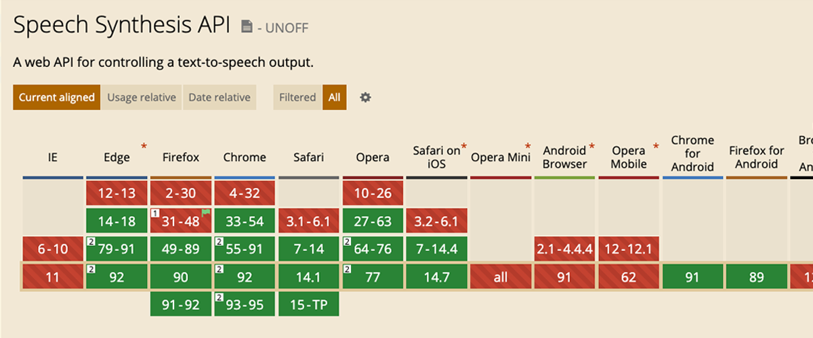
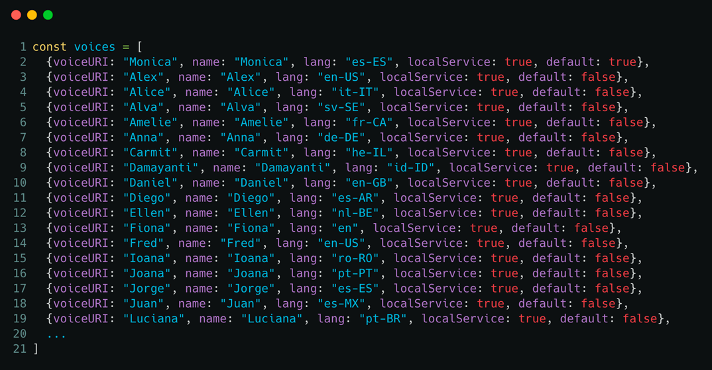

La **Web Speech API** permite añadir voz a tus aplicaciones web directamente desde el navegador.

Se divide en dos partes:

- **SpeechSynthesis**: convierte texto en voz (TTS).
- **SpeechRecognition**: convierte voz en texto (STT).

En este artículo nos centramos en **SpeechSynthesis**, la parte que hace que el navegador hable.

## Haciendo que el navegador hable 🗣

La mayoría de navegadores modernos ya implementan esta API. No me gusta hablar como si estuviéramos en 2005, pero conviene recordarlo: asegúrate de que tu navegador la soporta.

¿Usas Chrome, Firefox o Safari actualizados? Debería funcionar.
¿Estás en móvil? Ahí puede haber más limitaciones.

Puedes comprobar la compatibilidad aquí: [https://caniuse.com/#feat=speech-synthesis](https://caniuse.com/#feat=speech-synthesis).



A primera vista, el soporte parece bastante bueno, pero tiene truco.
El soporte _completo_ está más limitado de lo que parece.

Algunas funcionalidades, como elegir la **voz**, ajustar el **tono** o la **velocidad**, pueden variar según navegador, sistema operativo y dispositivo.

## Demo Time

Todos los ejemplos están probados en Chrome.

```javascript
// Lo primero es obtener el sintetizador de voz
const synth = window.speechSynthesis;

// Creamos un objeto con el texto que queremos que diga
const text = "Soy Jorge Baumann, @baumannzone en Instagram";
const utterThis = new SpeechSynthesisUtterance(text);

// Le decimos al navegador que hable
synth.speak(utterThis);
```

Fácil, ¿verdad?

Ahora te toca a ti: cambia el texto y haz que tu navegador hable.

### Todo en una línea

Pega esto en la consola del navegador y escucha la magia 🎩

```js
window.speechSynthesis.speak(
  new SpeechSynthesisUtterance(
    "¡Hola! Soy Jorge Baumann (@baumannzone en Instagram)",
  ),
);
```

## Controles adicionales

Hasta ahora has hecho que el navegador hable con los valores por defecto. Vamos a ver cómo ajustar la voz, la velocidad y el tono.

### Velocidad y tono

Por defecto, ambos tienen un valor de `1`, pero puedes modificarlos fácilmente así:

```javascript
const text = "Visita baumannzone.dev para más desarrollo web pro";

const synth = window.speechSynthesis;
const utterThis = new SpeechSynthesisUtterance(text);

// Cambiar el tono (por defecto es 1)
utterThis.pitch = 1.5;

// Cambiar la velocidad (por defecto es 1)
utterThis.rate = 1.5;

synth.speak(utterThis);
```

Una vez más, te toca a ti. Juega con los valores de `pitch` y `rate` para ver cómo cambia la voz.

## Houston, tenemos un problema

Si has tenido problemas al cambiar la velocidad o el tono, probablemente usaste valores fuera del rango permitido.

Por ejemplo, un tono (`pitch`) de `3` no funcionará correctamente.

Entonces, ¿cuáles son los rangos válidos?

### `pitch`: valores permitidos

Según la especificación, el tono puede ir de `0` (más grave) a `2` (más agudo). El valor por defecto es `1`.

### `rate`: valores permitidos

La velocidad (`rate`) puede ir de `0.1` a `10`. El valor por defecto también es `1`.


## ¡Cambia la voz!

Hasta ahora hemos usado la voz por defecto del sistema. Vamos a elegir una voz concreta.

El primer paso es obtener el listado de voces con `getVoices()`. Si hay una voz en español, la usamos; si no, tiramos de la primera disponible.

```javascript
const synth = window.speechSynthesis;
const text = "Puedes seguirme en Bluesky: @baumannzone";
const utterThis = new SpeechSynthesisUtterance(text);

synth.onvoiceschanged = () => {
  const voices = synth.getVoices();
  if (!voices.length) return;

  const selectedVoice =
    voices.find((voice) => voice.lang.startsWith("es")) ?? voices[0];

  utterThis.voice = selectedVoice;
  synth.speak(utterThis);
};
```

### Ojo con esto

La lista de voces se carga de forma **asíncrona**, así que `getVoices()` puede devolverte un array vacío si la llamas demasiado pronto. Por eso usamos `onvoiceschanged`.

Y aquí tienes un listado de voces disponibles en Chrome en un MacBook Pro cuando publiqué este artículo originalmente (2018):




## Conclusión

La Web Speech API no es perfecta, pero es una API nativa muy útil para prototipos, features de accesibilidad y experiencias más interactivas.

Si vas a usarla en producción, valida soporte por navegador, prueba en móvil y controla bien los fallbacks. Con eso, puedes sacar mucho valor sin meter dependencias externas.
