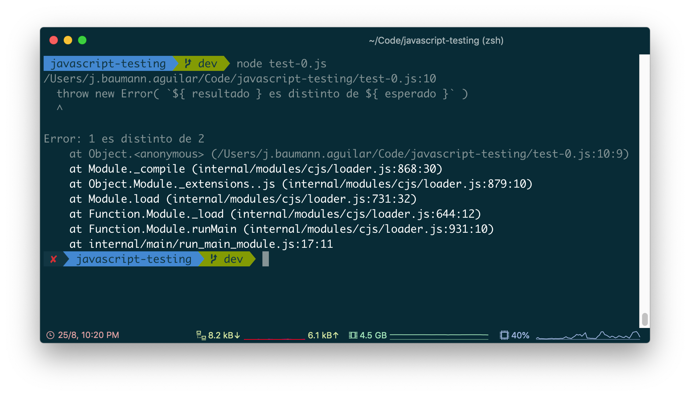
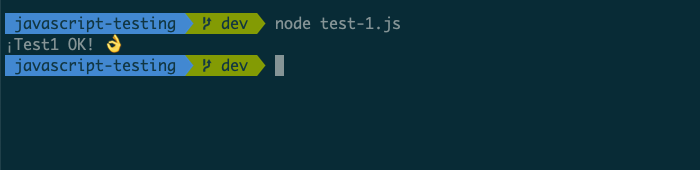
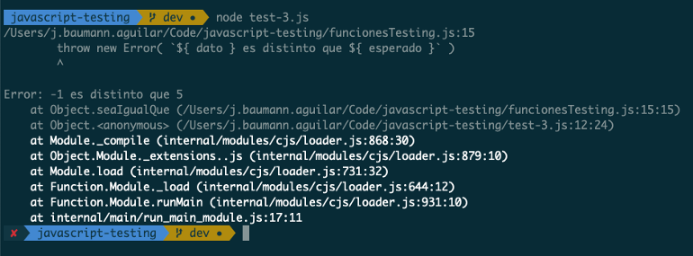
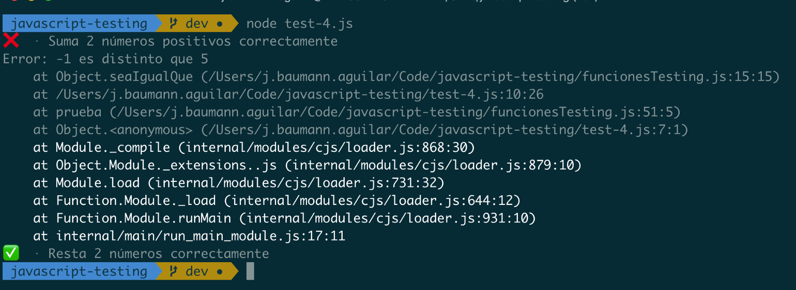
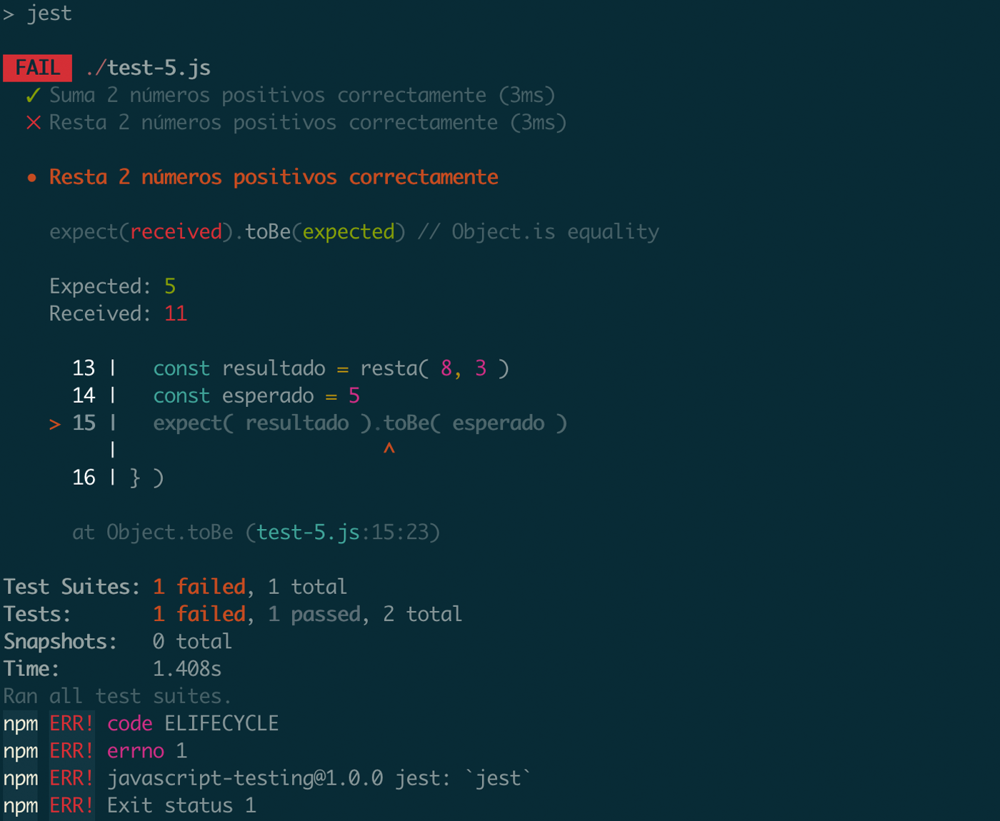

Introducción práctica a los tests con JavaScript (a través de Node.js) guiada por ejemplos progresivos: “_de 0 a framework_”.


> Photo by [Toni Cuenca](https://unsplash.com/@tonicuenca?ref=baumannzone.dev)

Hola de nuevo, querido developer.

Existen muchas y variadas razones por las que considero que los tests son útiles e importantes.

No las vamos a mencionar ahora, pero si has leído este [artículo](/blog/about-testing) con anterioridad, ya sabrás lo importante que son los tests en el desarrollo de software en general.

Recuerda, cuando hablemos de pruebas (o tests), nos estamos refiriendo a **pruebas automáticas**, entendiendo como tales el proceso de escribir código que compruebe que nuestra aplicación funciona correctamente.

El proceso a seguir es el siguiente: primero crearemos un fichero que contenga un par de funciones y después escribiremos unos tests que comprueben que dichas funciones se comportan correctamente.

Para que sea más fácil, te dejo este [repositorio en GitHub](https://github.com/baumannzone/javascript-testing) con todos los ejemplos que vamos a necesitar.

El fichero que vamos a testear es el de `funcionesMatematicas.js`.

Ahí están las dos funciones (función `suma` y función `resta`) que iremos testeando de manera progresiva durante todo el artículo.

```javascript
// funcionesMatematicas.js

const suma = (num1, num2) => num1 + num2;
const resta = (num1, num2) => num1 - num2;

module.exports = { suma, resta };
```

Podemos empezar. Sabemos lo que hay que hacer y tenemos código que listo para ser testeado.

## Paso 0

¿Cuál es el ejemplo de test más básico que podemos crear? Para mí, sería algo como esto:

```javascript
// test0.js

const resultado = 1;
const esperado = 2;

if (resultado !== esperado) {
  throw new Error(`${resultado} es distinto de ${esperado}`);
}

console.log("¡Todo OK! 👌");
```

Puedes ejecutar este test corriendo `node test-0.js` desde la terminal. Y ya lo tienes, ¡tu primer test con JavaScript! 🎉


Resultado de error tras ejecutar el test-0.js

Cuando lo ejecutes, debería saltarte un error. Puedes probar a cambiar las variables `resultado` y `esperado` para dejarlas con el mismo valor.  
Esta vez, si lo ejecutas, verás que el error ya no aparece, y en su lugar está un mensaje: `¡Todo OK! 👌`

### Un test

Básicamente, esto es un test. Un valor de entrada (resultado de una operación) que comparamos con otro valor (valor esperado).

- Si se cumple la condición, el test pasa correctamente.
- De lo contrario, el test falla y mostraría un error.

En este caso la condición es que los valores sean iguales, pero puede ser cualquier otra cosa, por ejemplo, “mayor que”.

La parte del código donde pone `resultado !== esperado` es lo que se conoce como **aserción** o aserto, en inglés _assert_.  
Es la parte clave de nuestro test, si la aserción falla, lanzaremos un error.

### Testing

¿Así de fácil? Desde luego que no, apreciado lector. La cosa se puede complicar más, pero tenemos que empezar por el principio.

Aunque se pueda complicar en el futuro, probar las dos funciones de nuestro módulo `funcionesMatematicas.js` es extremadamente fácil, ya que son funciones puras.

### Funciones puras

Si no sabes lo que son, te interesa saber que en las funciones puras dados los mismos valores de entrada (argumentos) siempre retornan el mismo valor de salida.
Con un ejemplo lo entenderás mejor:

```javascript
// Es función pura
const suma = (num1, num2) => num1 + num2;
suma(2, 2); // => 4
suma(2, 2); // => 4

// No es función pura
const tiempoMilisegundos = () => Date.now();
tiempoMilisegundos(); // => 1566762448192
tiempoMilisegundos(); // => 1566762450684
```

Ya sabemos cómo testear con JavaScript y tenemos una función pura deseosa de ser testeada. Me imagino que ya sabes cuál es el siguiente paso, ¿verdad?

## Paso 1

Vamos a crear el test más simple posible para nuestras funciones aritméticas.

```javascript
// test-1.js

const { suma, resta } = require("./funcionesMatematicas");

let resultado, esperado;

// Probar suma ( 2 + 3 )
resultado = suma(2, 3);
esperado = 5;
if (resultado !== esperado) {
  throw new Error(`${resultado} es distinto de ${esperado}`);
}

// Probar resta ( 8 - 3 )
resultado = resta(8, 3);
esperado = 5;
if (resultado !== esperado) {
  throw new Error(`${resultado} es distinto de ${esperado}`);
}

console.log("¡Test1 OK! 👌");
```

Ejecutamos el test desde la terminal con `node test-1.js` y podemos ver que la ejecución ha terminado con éxito.



Ahora probemos a _romper_ la función `suma`. Quitamos el signo de suma (`+`) y ponemos el de resta (`-`). Al ejecutar el test de nuevo verás un error parecido a este:

```yaml
~/javascript-testing/test-1.js:13

  throw new Error( \`${ resultado } es distinto de ${ esperado }\` )

  Error: -1 es distinto de 5

  at Object.<anonymous> (~/Code/javascript-testing/test-1.js:13:9)
  at Module.\_compile (internal/modules/cjs/loader.js:868:30)
  at Object.Module.\_extensions..js
  ...
```

¿No es genial? Hemos roto la función `suma` y gracias a nuestro test, nos hemos dado cuenta inmediatamente. ¡Somos developers orgullosos y felices!

Ahora podemos estar seguros de que si hacemos algún cambio que rompa la funcionalidad, nuestro test nos avisará.

Los **mensajes de error** son otro elemento clave de nuestras pruebas.  
Son realmente importantes, pues es lo primero que vemos cuando nuestro test falla y a menudo nos indican **qué** y **dónde** ha fallado.  
Por lo tanto, querido developer, deberíamos intentar ser lo más específicos posibles a la hora de redactar los mensajes de error y de usar las aserciones correspondientes para cada caso.

## Paso 2

Node.js tiene un [módulo](https://nodejs.org/api/assert.html#assert_assert) (_assert_) para hacer aserciones. ¡No necesitamos reinventar la rueda!

Vamos a refactorizar nuestro test haciendo uso de dicho módulo, con el método `strictEqual`. (Más info en la [documentación oficial](https://nodejs.org/api/assert.html#assert_assert_strictequal_actual_expected_message))

```javascript
// test-2.js

const assert = require("assert");
const { suma, resta } = require("./funcionesMatematicas");

let resultado, esperado;

resultado = suma(2, 3);
esperado = 5;
assert.strictEqual(resultado, esperado);

resultado = resta(8, 3);
esperado = 5;
assert.strictEqual(resultado, esperado);

console.log("¡Test2 OK! 👌");
```

Estupendo, el test sigue funcionando igual que antes, lo único que ha cambiado es el mensaje de error.

```
$ node test-2.js
assert.js:89
  throw new AssertionError(obj);
  ^
AssertionError [ERR_ASSERTION]: Expected values to be strictly equal:

-1 !== 5

    at Object.<anonymous> (/javascript-testing/test-2.js:13:8)
    ...
    at internal/main/run_main_module.js:17:11 {
  generatedMessage: true,
  code: 'ERR_ASSERTION',
  actual: -1,
  expected: 5,
  operator: 'strictEqual'
}
```

He truncado parte de la respuesta para que sea más clara la información. Parece una respuesta más completa y es decisión nuestra, como testers, elegir qué sistema queremos usar.

Si miramos la documentación, podemos ver que `strictEqual` soporta 3 argumentos, sin embargo, nosotros le hemos pasado dos. El tercero nos permite personalizar el mensaje de error.

## Paso 3

Llegados a este punto, podríamos empezar a crear nuestro _mini-framework_ o pequeña _librería_ de testing.

Entra en juego otro fichero, `funcionesTesting.js`, en el cual vamos a ir agregando algunas funciones de ayuda para correr nuestras pruebas.

```javascript
// funcionesTesting.js

const esperoQue = (dato) => {
  return {
    seaIgualQue: (esperado) => {
      if (dato !== esperado) {
        throw new Error(`${dato} es distinto que ${esperado}`);
      }
    },
  };
};

module.exports = { esperoQue };
```

Vamos a reestructurar nuestros tests. En vez de usar el módulo de aserción de Node.js, vamos a utilizar la funcionalidad que acabamos de crear. Quedaría algo como esto:

```javascript
// test-3.js

const { suma, resta } = require("./funcionesMatematicas");
const { esperoQue } = require("./funcionesTesting");

let resultado, esperado;

resultado = suma(2, 3);
esperado = 5;
esperoQue(resultado).seaIgualQue(esperado);

resultado = resta(8, 3);
esperado = 5;
esperoQue(resultado).seaIgualQue(esperado);

console.log("¡Test3 OK! 👌");
```

Vamos a repetir el procedimiento que hicimos anteriormente. Rompemos la función `suma` cambiando el `+` por el `-` y ejecutamos el test 3 con el siguiente comando `node test-3.js`.
Si todo va bien, deberíamos seguir viendo que el test nos alerta de que algo anda mal.



¡Fantástico! Podemos añadir algunas aserciones más (como por ejemplo `seaMayorQue` o `seaMenorQue`, etc).
Las puedes ver en el fichero [funcionesTesting.js](https://github.com/baumannzone/javascript-testing/blob/master/funcionesTesting.js) del repositorio, en GitHub.

Este es un buen punto para parar y arreglar un par de problemas que llevamos arrastrando desde el principio.

Actualmente, cuando ejecutamos las pruebas y nos informan de un error, no tenemos forma de saber qué funcionalidad ha fallado.
Sabemos que está fallando la función `suma`, pero podría ser perfectamente la función `resta`.
Nuestro mensaje de error no es tan descriptivo como debería ser.

Asimismo, nos hemos dado cuenta de que nuestras pruebas no están completamente aisladas unas de otras.

## Paso 4

Vamos a escribir una nueva función que nos permita mantener las pruebas **aisladas** y que, en caso de fallo, nos indique **cuál** es la funcionalidad que está fallando.

```javascript
// funcionesTesting.js

const esperoQue = (dato) => {
  return {
    seaIgualQue: (esperado) => {
      if (dato !== esperado) {
        throw new Error(`${dato} es distinto que ${esperado}`);
      }
    },
  };
};

const prueba = (titulo, funcion) => {
  try {
    funcion();
    console.log(`✅  · ${titulo}`);
  } catch (error) {
    console.error(`❌  · ${titulo}`);
    console.error(error);
  }
};

module.exports = { esperoQue, prueba };
```

Acabamos de crear la función `prueba`, que nos va a resolver dichos problemas.
Esta función requiere dos argumentos para ejecutarse, el título o nombre descriptivo del test y la función que vamos a ejecutar, también conocida como _callback_.
Si quieres saber más sobre callbacks, te recomiendo leer [este artículo](https://medium.com/@anamartinezaguilar/callbacks-en-javascript-8deeca9824b4) de Ana Martínez Aguilar.

Ahora podemos meter todo el código de nuestro test en el callback `prueba` y darle un nombre descriptivo.
Hemos logrado aislar el código de nuestras pruebas y, además, tenemos mensajes de error más descriptivos que nos indican qué ha fallado.

Ejecutemos el test `test-4.js` y veamos cómo queda.



Tenemos un [listado](../../assets/blog/testing-con-javascript/test-4.mp4) de todos los tests que hemos ejecutado, los que han finalizado con éxito y los que no.

Antes, en caso de fallo, nos aparecía el mensaje de error pero no sabíamos de dónde provenía el fallo.  
Ahora, en caso de error, se nos muestra el propio error, por lo tanto sabremos exactamente qué es lo que tenemos que rectificar.

## Paso 5

Nuestro framework de testing va cogiendo forma.
Una buena funcionalidad a implementar sería la creación de una interfaz de línea de comandos (_CLI_). Podríamos usar [vorpal](https://vorpal.js.org/) y tratar que se encargara de buscar todas las pruebas de nuestro proyecto y que las ejecutara.

Llegados a este punto, estaríamos construyendo un corredor de pruebas (_test runner_) y un framework para crear nuestras pruebas.  
Pero incluso después de realizar esta funcionalidad, nos seguiría quedando muchísimo trabajo por hacer para que nuestro framework de testing estuviera listo.

Actualmente existen en el “mercado” bastantes frameworks o librerías de este tipo, mucho más robustas que la nuestra. Por lo tanto, lo primero que tenemos que hacer es elegir con cuál queremos trabajar.


En un principio pensé en usar [AVA](https://github.com/avajs/ava) 🚀, que me gusta porque es bastante simple y moderno. Sin embargo, desde mi punto de vista tiene una pequeña deficiencia: la documentación.
Por lo tanto, la segunda opción, sin duda alguna es [Jest](https://jestjs.io/) 🃏. En el entorno profesional es el framework de testing que más utilizo y su documentación me parece bastante buena y es más intuitiva.

A día de hoy (_mayo de 2024_), si tuviera que hacer la elección, me quedaría con [Vitest](https://vitest.dev/), el framework de testing para gente cool. 😎

Por lo tanto, en vez de seguir añadiendo funcionalidades a nuestro framework, vamos a refactorizar nuestro código para que funcione con Jest.

Casualmente, las funciones de Jest son muy similares a las nuestras. Lo único que tendríamos que hacer es cambiar nuestras funciones `prueba` y `esperoQue` por las propias de Jest: `test` y `expect`.

```javascript
// test-5.js

const { suma, resta } = require("./funcionesMatematicas");

test("Suma 2 números positivos correctamente", () => {
  const resultado = suma(2, 3);
  const esperado = 5;
  expect(resultado).toBe(esperado);
});

test("Resta 2 números positivos correctamente", () => {
  const resultado = resta(8, 3);
  const esperado = 5;
  expect(resultado).toBe(esperado);
});
```

Ejecutamos nuestra quinta prueba con Jest: `npm run jest`, y si está todo correcto, deberíamos ver algo como esto:

```yaml
~/javascript-testing: npm run jest

> jest

PASS  ./test-5.js

  ✓ Suma 2 números positivos correctamente (3ms)
  ✓ Resta 2 números positivos correctamente

Test Suites: 1 passed, 1 total

Tests:       2 passed, 2 total
Snapshots:   0 total
Time:        1.672s

Ran all test suites.
```

¡Funciona! Como puedes observar, tester friend, el resultado que nos ofrece Jest es bastante más completo que el que teníamos nosotros.

Probemos ahora a romper la función `resta` cambiando el `-` por el `+`. Ejecutemos de nuevo Jest.



En esta imagen se ve mucho más claro qué está fallando. Tiene colores y además nos dice qué y dónde ha fallado junto con mucha más información de ayuda. ¡Bastante descriptivo!

<!-- # Las encuestas 🍿

Antes de empezar a escribir este artículo lancé en twitter un par de encuestas:

- ¿[Has escrito alguna vez tests para tus aplicaciones JavaScript](https://twitter.com/baumannzone/status/1165178014579273728)?

- [¿Serías capaz de testear una aplicación JavaScript sin usar frameworks?](https://twitter.com/baumannzone/status/1165178021273395200)

Este escrito es el motivo que hay detrás de estas encuestas.

Si después de leer este artículo tuvieras que votar... _¿Qué votarías?_
Imagino que ahora responderías "sí" a ambas preguntas. -->

Ahora ya sabes cómo testear tus aplicaciones JavaScript de manera progresiva, desde 0 hasta llegar a un framework de testing como Jest.

Y tú, ¿con qué herramientas testeas tus aplicaciones JavaScript?

¡Happy testing! 🧪
