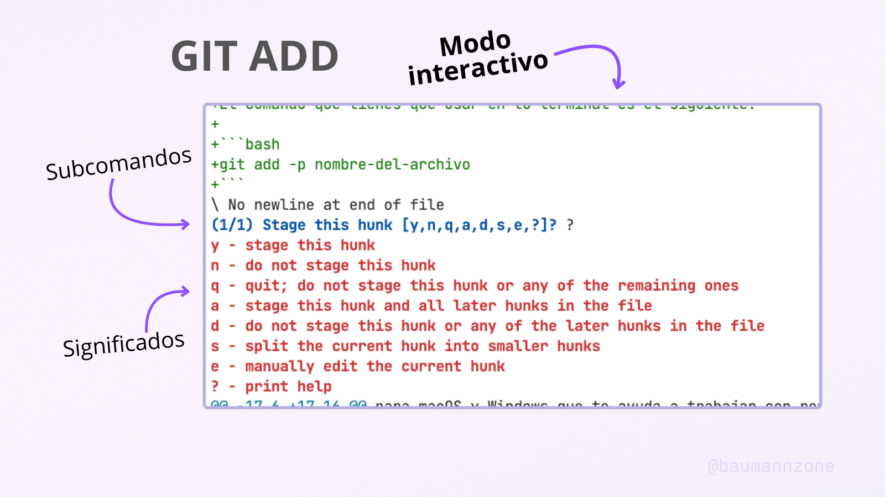

Usar Git desde la terminal es algo que deberías dominar si quieres progresar como desarrollador. Sin embargo, si prefieres una interfaz gráfica, [Git Tower](https://www.git-tower.com/?via=baumannzone) es una excelente alternativa.

## ¿Qué es Git Tower?

[](https://www.git-tower.com/?via=baumannzone)

Git Tower no es simplemente otro cliente Git con interfaz gráfica. Se trata de una herramienta profesional que revoluciona la manera de trabajar con Git. Llevo años utilizándolo y, gracias a esta experiencia, puedo afirmar que ha transformado mi flujo de trabajo y, sobre todo, mi comprensión de Git.

Sí, he aprendido mucho sobre Git gracias a Tower, sigue leyendo y al final te cuento cómo.

Detrás de cada acción que realizamos en cualquier cliente gráfico de Git, existe un comando de Git. Tiene sentido, ¿no?

## Deshacer con `⌘ + Z`

Esta es una de las funcionalidades que más me gustan de Git Tower. La que más uso en mi día a día como desarrollador.

¿Te imaginas deshacer tus cambios en Git con un simple clic? Tower ofrece justo eso y más. Con `⌘ + Z` deshacer acciones recientes con un simple clic o con un atajo de teclado.

- Creas una rama nueva y quieres volver atrás: `⌘ + Z`
- Haces un commit y te das cuenta de que te has equivocado: `⌘ + Z`
- Borras un stash por error: `⌘ + Z`

<figure  >
<video width="100%" controls loop autoplay muted>
  <source src="https://res.cloudinary.com/baumannzone/video/upload/v1738190748/git-tower-cmd-z.mp4" type="video/mp4">
</video>
<figcaption>En el video se muestra cómo se crea una rama y con <code>⌘ + Z</code> se deshace la acción, haciendo que la rama desaparezca. Si luego cambias de opinión y deseas conservar la rama, puedes pulsar <code>Shift + ⌘ + Z</code> para rehacerla.</figcaption>
</figure>

Si después de deshacer una acción te das cuenta de que no era lo que querías hacer, siempre puedes rehacerla con `Shift + ⌘ + Z`. ¡Magia! 🔮

## Arrastra todo en Git Tower con Drag & Drop

Una de las características más irresistibles de [Git Tower](https://www.git-tower.com/?via=baumannzone) es la posibilidad de arrastrar y soltar prácticamente cualquier elemento dentro de la aplicación.

- Quieres hacer un cherry-pick: arrastra y suelta el commit
- Quieres reordenar tus commits: arrastra y suelta el commit
- Quieres mover un stash a otra rama: arrastra y suelta el stash

<video width="100%" controls loop autoplay muted>
  <source src="https://res.cloudinary.com/baumannzone/video/upload/v1738259325/BlogBaumannzone.dev/git-tower-drag-and-drop.mp4" type="video/mp4">
</video>

## Desbloquea el modo interactivo de `git add` y conviértete en la GOAT

He aprendido mucho sobre todas las posibilidad que ofrece Git gracias a Git Tower. **¿Cuántas veces has ejecutado un comando de Git sin saber qué hace realmente por detrás?** Yo lo he hecho muchas veces.

🤯 Te voy a dar un ejemplo que me voló la cabeza cuando lo descubrí y que me hizo ser mejor programador. ¡Este es mi trucazo secreto!

**¿Sabías que puedes seleccionar las líneas de código que quieres agregar a un commit?** Me explico, en vez de agregar todos los cambios del archivo, puedes seleccionar las líneas que quieres agregar y dejar otras fuera del commit.

El comando que tienes que usar en tu terminal es el siguiente:

```bash
git add -p nombre-del-archivo
```

Una vez que ejecutes ese comando, entrarás en el **modo interactivo** y Git te mostrará tus cambios en bloques (también llamados "_hunks_"). Para cada uno, podrás elegir:

- `y` para agregarlos al commit
- `n` para omitirlos
- `s` para dividirlos en trozos más pequeños
- `e` para editar manualmente qué líneas se incluyen
- y más opciones que puedes ver en la ayuda (`?`)

[](https://www.git-tower.com/?via=baumannzone)

En la imagen se puede ver la accion que puedes realizar (`Stage this hunk`) y el listado de subcomandos disponibles para cada hunk: `[y, n, q, a, d, s, e, ?]`.

En el modo interactivo, puedes elegir qué líneas quieres agregar a tu commit y cuáles no. Esto es muy útil si, por ejemplo, has editado varias partes de un archivo (como el `<header>` y el `<footer>` de tu `index.html`) y quieres hacer un commit parcial para tener todo organizado y separado por funcionalidades.

Esta funcionalidad viene por defecto con Git, no es algo exclusivo de Tower. Sin embargo, la primera vez que la utilicé fue precisamente gracias a Tower. A partir de ahí, empecé a profundizar más en Git y a interesarme por los comandos que hay detrás de cada acción.
