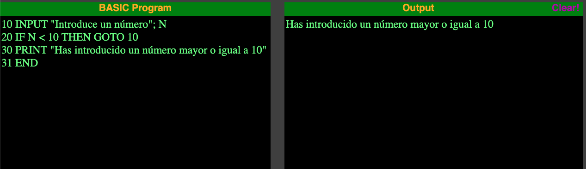
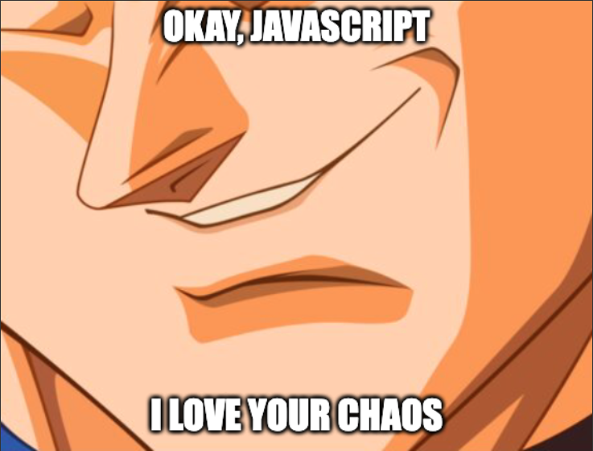

Las etiquetas en JavaScript son identificadores seguidos de dos puntos (`:`) que se pueden asociar a bucles o bloques de código. 

Su principal función es proporcionar un punto de referencia para las instrucciones `break` y `continue`, permitiendo un control más preciso sobre el flujo de ejecución en estructuras anidadas.

## Ejemplo con bucles anidados

En JavaScript, las etiquetas (`label`) son especialmente útiles en bucles anidados cuando quieres controlar exactamente desde qué nivel quieres salir (`break`) o continuar (`continue`). Aquí tienes un ejemplo claro:

```javascript
externo: for (let i = 1; i <= 3; i++) {
  interno: for (let j = 1; j <= 3; j++) {
    if (i * j > 5) {
      break externo; // => Sale completamente de ambos bucles
    }
    console.log(`${i} x ${j} = ${i * j}`);
  }
}
```

En este ejemplo, la etiqueta `externo` permite salir de ambos bucles cuando la multiplicación de `i` y `j` supera el valor `5`. Sin la etiqueta, solo abandonaría el bucle `interno`.

## Ejemplo con bloques de código

También funcionan con bloques de código (pero no lo hagas):

```javascript
bloque: {
  console.log("Inicio del bloque");
  if (true) {
    break bloque; // => Sale del bloque
  }
  console.log("Este mensaje no se mostrará nunca");
}
```

Sí, has leído bien. Puedes ponerle un `label` a un bloque de código y romperlo con `break`. Técnicamente es válido, pero la legibilidad empeora bastante.

Este mecanismo recuerda inevitablemente a estructuras de control antiguas, como el famoso `GOTO` de **BASIC**:

```basic
10 INPUT "Introduce un número"; N
20 IF N < 10 THEN GOTO 10
30 PRINT "Has introducido un número mayor o igual a 10"
```


<figcaption> Resultado del ejemplo de BASIC ejecutado en un emulador.</figcaption>

Esto funcionaba perfectamente en BASIC por la naturaleza del lenguaje, pero hacerlo hoy en JavaScript sería volver absurdamente 30 años atrás. 

## ¿Por qué no usar etiquetas?

Aunque es posible y legal usar etiquetas en JavaScript, jamás me he encontrado con la necesidad de usarlas y espero seguir así.

Para eso existen los `if`, `else`, `switch` y otras estructuras de control que son mucho más legibles y mantenibles.

## Conclusión

Sí, JavaScript tiene su propia versión ligera del _GOTO_: las **sentencias etiquetadas** o labeled statements.

¿Las necesitas? Lo más probable es que no. ¿Vas a usarlas? Espero que tampoco. ¿Mola saber que existen? Sin duda 🤘.

Es una de esas features que te hacen levantar una ceja, sonreír y pensar: "_vale, JavaScript... me encanta tu caos_".



**Recuerda**: úsalas solo si puedes dormir tranquilo sabiendo que alguien tendrá que mantener ese código después. Puede que seas tú.
