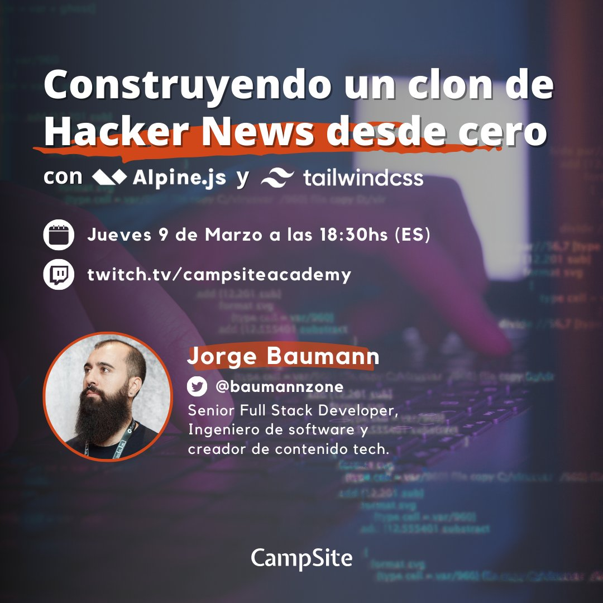

En este workshop, construimos un clon de Hacker News utilizando Alpine.js y Tailwind CSS desde cero.

<!-- /src/content/blog/creando-un-clon-de-hacker-news-con-alpinejs-y-tailwind-css.md -->

Puedes leer el artículo completo en mi blog: [Creando un clon de Hacker News con Alpine.js y Tailwind CSS](https://baumannzone.dev/blog/creando-un-clon-de-hacker-news-con-alpinejs-y-tailwind-css).

