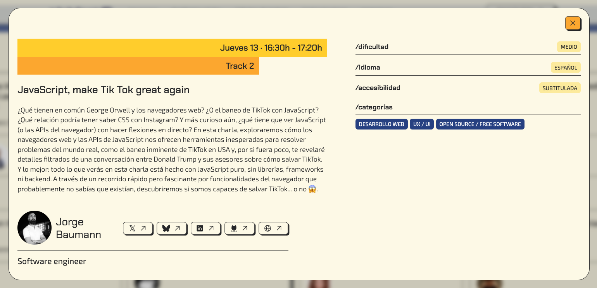
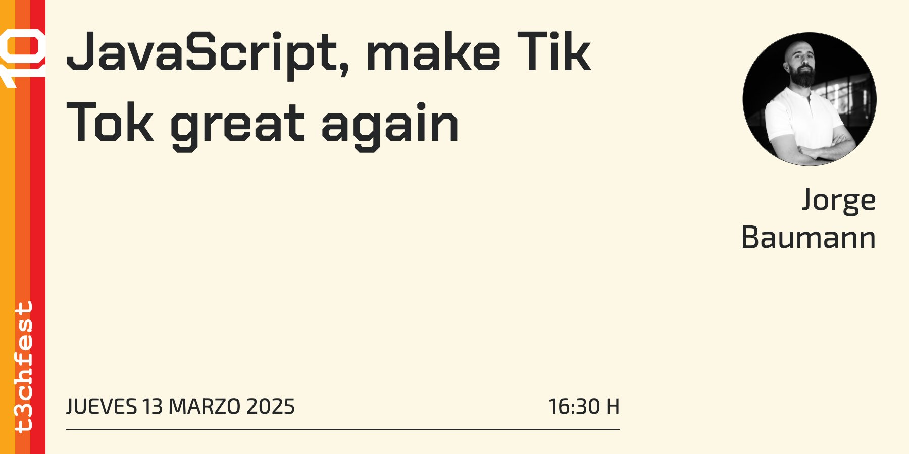
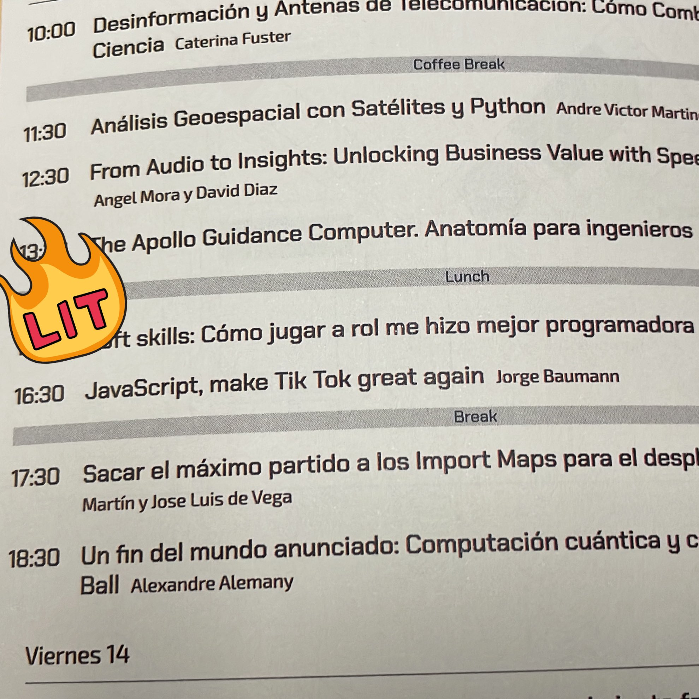

> ¿Qué tienen en común George Orwell y los navegadores web? ¿O el baneo de TikTok con JavaScript? ¿Qué relación podría tener saber CSS con Instagram? Y más curioso aún, ¿qué tiene que ver JavaScript con hacer flexiones en directo? En esta charla, exploraremos cómo los navegadores web nos ofrecen herramientas inesperadas para resolver problemas del mundo real, como el baneo inminente de TikTok en USA y, por si fuera poco, te revelaré conversaciones filtradas por la Casa Blanca. Y lo mejor: todo lo que verás en esta charla está hecho con JavaScript puro, sin librerías, frameworks ni backend. A través de un recorrido rápido pero fascinante por funcionalidades del navegador que probablemente no sabías que existían, descubriremos si somos capaces de salvar TikTok... o no 😱

