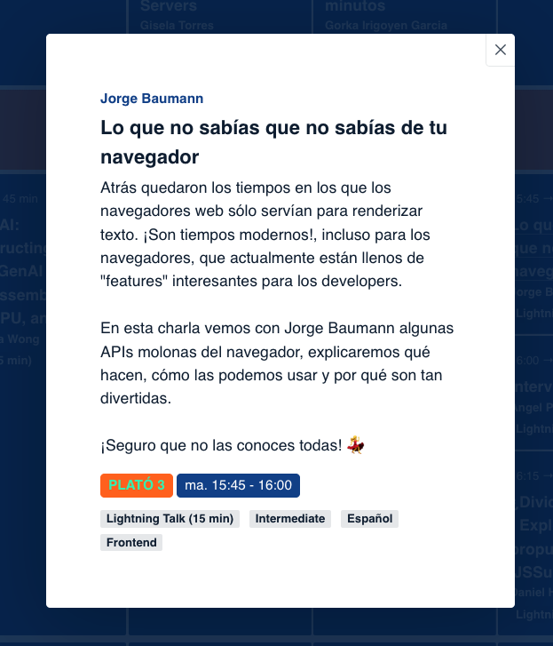

> Atrás quedaron los tiempos en los que los navegadores web sólo servían para renderizar texto. ¡Son tiempos modernos!, incluso para los navegadores, que actualmente están llenos de "features" interesantes para los developers.
> En esta charla vemos con Jorge Baumann algunas APIs molonas del navegador, explicaremos qué hacen, cómo las podemos usar y por qué son tan divertidas.
> ¡Seguro que no las conoces todas! 💃

