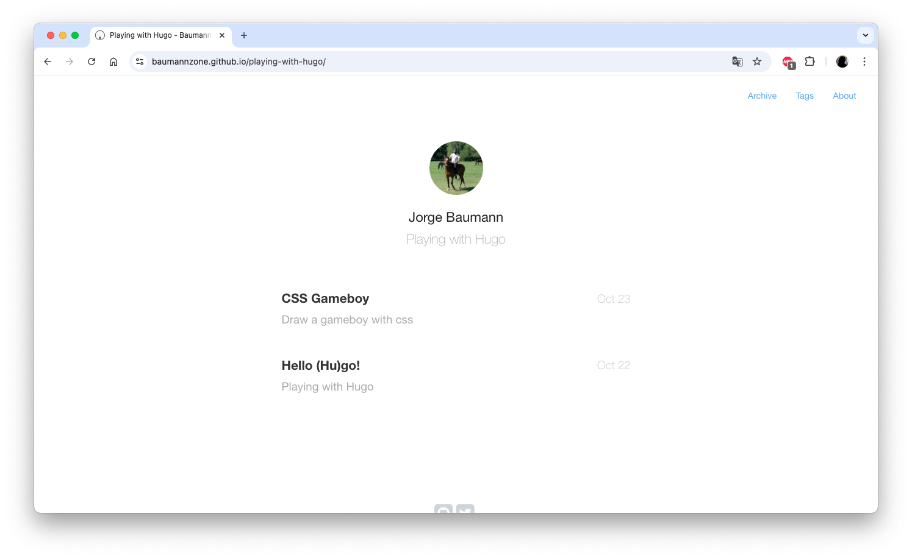

En este taller, hicimos un recorrido por las características más importantes de Hugo, uno de los generadores de sitios estáticos más rápidos del mundo (en su día).

Después subimos a GitHub Pages nuestro sitio personal y vimos que fácil que era crear un blog con él.

