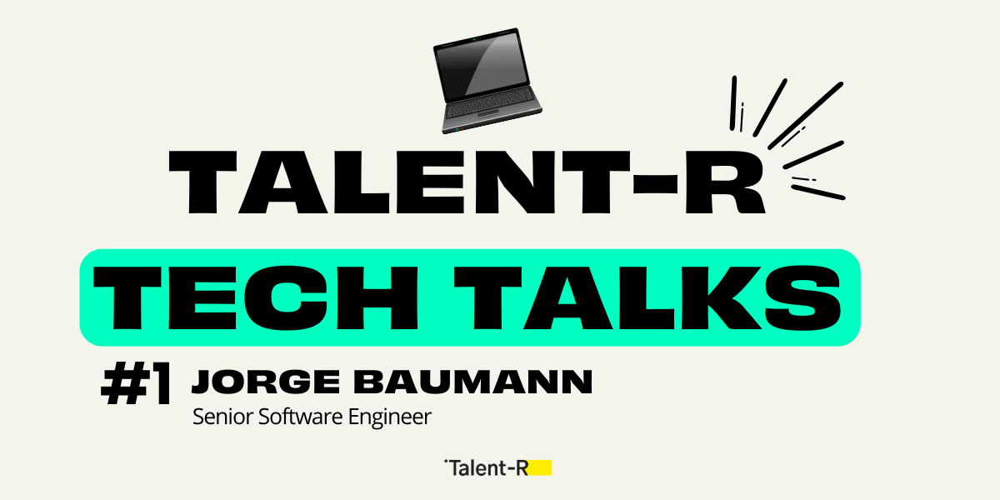

Entrevista en inglés publicada en el blog de Talent-R.

---

I had the pleasure of being interviewed by Talent-R for their Tech Talks series. In this interview, I share insights about my journey in web development, the evolution of the tech industry, and advice for those looking to grow their careers in tech.

The interview covers various topics including:

- My journey in web development
- Significant changes in the tech industry
- Emerging technologies that excite me
- Advice for those starting in web development
- The future of web development
- Tips for companies hiring tech talent
- How to prepare for a career in web development or content creation
